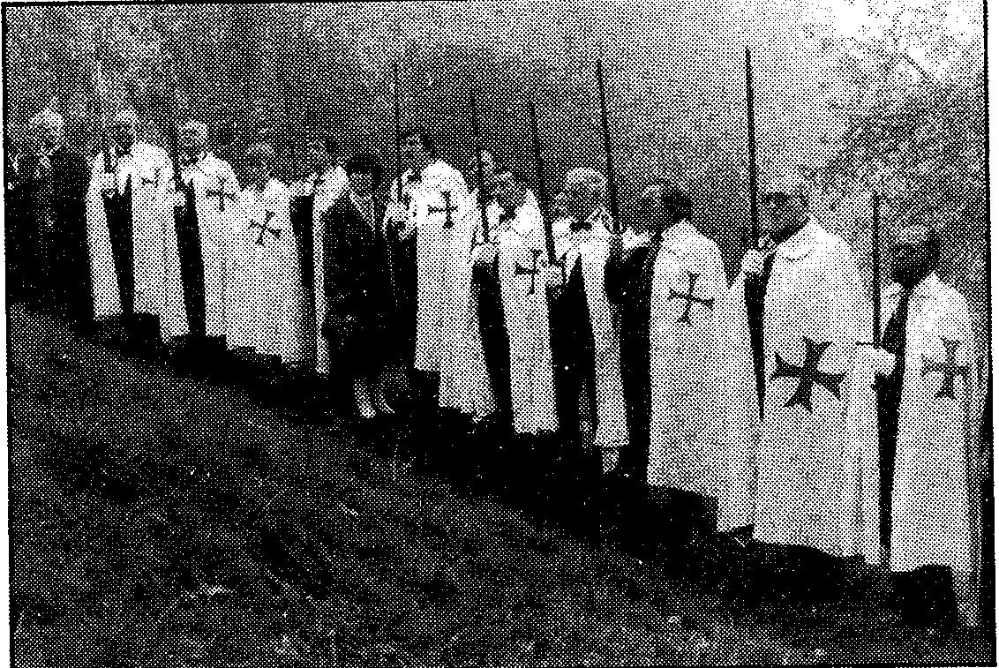

原则上，这种教学是免费的。当然会有行政费用。1983年的注册费是1400法郎。支付每年4200法郎的会费后，您便可以在家中获取每月的 teringen（原文，具体含义不详，可能为内部刊物）。不过，这些资料仍归 ORT 所有，您只能借阅。毕竟，一旦被解雇，您承诺将所收到的全部文件归还律师公会 16.

从位于莫里埃尔（Molières）的奥蒂城堡（Château d'Auty，法国总部）以及瓦隆布拉班特省奥蒂尼（Ottignies，比利时总部）17 出发，重建圣殿骑士团（Ordre Renove du Temple）正在筹划其宏大的计划：它在打造“明日世界的精英”18。

Intermède I（插曲 I）

Origas 并不反对极右翼思想，他指控“白色女神”是一个国际兄弟会派遣来的，为了匹配地面上的雅利安帝国：即图勒社（société Thuléenne，Thulé Society）。当然，这项指责只是在他与 Angela 于 1977 年之间发生“混浊”（turbidité，原文）之后才出现的。可是...... Origas 也许真的知道！此外，Origas 和 Angela 还与一位自称纳粹的布鲁塞尔骑士有过接触：绿色骑士团（l'Ordre vert）。

{style="width:5.83333in;height:3.8932in"}

