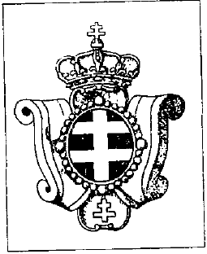

Les Chevaliers de Monseigneur（“主教的骑士”）

{style="width:1.5in;height:1.84722in"}

在当今科技时代，保护和传播基督教价值的战斗仍在不懈进行。就此而言，自十字军东征以来变化不大。直到今天，主教与宗主教仍然集结众多骑士，以期让那些邪恶者或共产主义者——这些新的敌人——屈服。这样，教皇便可以号召他的骑士。小型教会的领袖也会创建一支基督徒精英来保护自己。

我在多次骑士仪式上见过圣热雷翁骑士团（Ordre de Saint-Géréon）的骑士。不可错过：黑底上白色双十字的优雅长斗篷，在其他骑士团以白色或红色为主的披风之间格外醒目。圣热雷翁骑士团的渊源可追溯至第三次十字军东征。其后，德国皇帝弗雷德里克一世（Frédéric Ier，号“巴巴罗萨”Barberousse，约1123–1190）率军经巴尔干前往中东，欲夺回在1187年被苏丹萨拉丁（Saladin）占领的耶路撒冷。然而，弗雷德里克一世于1190年在席利西亚（Cilicie）塞莱夫（Selef）河中当着部队的面溺亡。传说弗雷德里克一世曾创建圣热雷翁骑士团以巩固耶路撒冷。史学在此问题上仍显得欠缺可靠。无论如何，1809年，科尔内依·史蒂文斯主教（Mgr Corneille Stevens）在比利时创立了一个传统小教会，“纪念已不复存在的圣热雷翁总主教区骑士团”。其目的在于捍卫传统信仰与基督徒骑士的理想。然而，这个兄弟会并未持续太久。

但是，正如一本 brochure6 所说：“1976年，终于，德·文特主教（Mgr De Vent），作为拉丁东方骑士传统的继承人，代表加利西亚天主教会（Église catholique galicienne）正式恢复了圣热雷翁大院（Capitole de Saint-Géréon）的骑士团。自1976年以来，加利西亚天主教会在比利时的首席权威也拥有了自己的士兵。德·文特主教当然成为该骑士团的大团长（Grand Maître）。”

