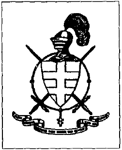

Les chevaliers du comte portugais

{style="width:1.48611in;height:1.83333in"}

有些浪漫，纳慕尔（Namur）这个郊区。那些成排一致的老旧工人房屋，顶多前面有一个经过丈量的小前花园，被不公正地夹在多条大型交通干道之间，破坏了景观。在贝尔格莱德（Belgrade）有一种冰冷、人工、死亡的感觉。

然而，从若泽·博达尔（José Bodart）家的后窗望去，黯淡阳光下的青翠森林展开。山丘闪耀。壮丽。客厅墙上挂着两把剑，象征博达尔的主张。这位五十六岁的男人，外表健壮却诚恳，自称是圣殿骑士（Templier）后裔，源自圣殿骑士团（Templiers），以纪念那些著名的圣殿骑士（Chevaliers du Temple），他们显然并未真的被“英俊者”菲利普（Philippe le Beau）一击致命——似乎是这样。

德·莫莱（De Molay）在临死前把他的权力交给了拉梅纽斯（Larmenius）。这也和什么一样确定，但官方上他们并不想知道。通过这份传承宪章（Charte de Transmission），以及几个世纪的继承，葡萄牙伯爵唐·费尔南多·坎佩洛·平托·佩雷雷·德·索萨·丰特斯（Don Fernando Campello Pinto Pereire de Sousa Fontes）目前是耶路撒冷圣殿主权军事团（Ordre Souverain et Militaire du Temple de Jérusalem），简称 OSMTJ 的摄政。索萨·丰特斯伯爵（comte Sousa Fontes），一位重要的房地产经纪人，是葡萄牙征服者——国王阿方索一世（Alphonse Ier，1109-1185）直系第 27 代后裔，因此在此意义上被授权取得 OSMTJ 的摄政权。

这位葡萄牙伯爵显然喜欢礼仪，因为他还拥有某种类似外交团的架构。若泽·博达尔是 OSMTJ 摄政的“比利时大使代表”（Lé gat Magistral de Belgique，一种类似大使的角色）。在这个职务上，他每三个月向其上司汇报圣殿骑士团在比利时的兴衰。一个博达尔显然非常满意的职位。他自豪地向我展示由索萨·丰特斯家族（Maison Sousa Fontes）签发的国际身份证。

“在比利时有用吗？”我小心地试探。

“对比利时国家来说几乎没有什么价值。”博达尔说，“但指令（commande）兄弟如果看到你口袋里有这样一张卡，就有义务帮助你。当我在德国，一个团里的兄弟必须至少给我 24 小时的栖身之所。每位骑士都有这样一张身份证。”

博达尔的妻子问我是否要一杯咖啡。请给我。她也明显为丈夫作为圣殿骑士以及索萨·丰特斯的“大使代表”这一尊衔而感到愉悦。

“您也是某个团的吗？”她问。我不得不让她失望。我只是好奇。

博达尔接过话头：“在比利时，骑士团大约有一百名骑士，主要分布在瓦隆（Wallonie）和布鲁塞尔（Bruxelles）。全世界这个数字达到 6000！但当然，我们已经不再像以前那样在军事上发达。现在，慈善方面最重要。我们是一个国际兄弟会，一个以团结为首要的共同体。”

“我想，是一种共济会（franc-maçon）会所。”

“是的，但有基督教灵感。”博达尔急忙补充。骑士团等级非常森严：按国家有一个“大优先区”（Grande Priorité），由“大优先区”领导。比利时的是来自 Spa 的卡米耶·帕朗（Camille Parent）。按省有一个执政领（bailliage），由一个执政领首领（bailliage）带领。每个领辖区包括一个或多个指令（commandement）。在纳慕尔有一个指令，在布鲁塞尔有三个。设立了指令的“工作室”（studios）。有一些工作室从事考古、秘学（ésotérisme）和历史……”

在这个背景下有趣的是布鲁塞尔的圣杯指令（Commanderie du Graal），参考了亚瑟王（Roi Arthur）那些神秘的故事，由 OSMTJ 的来访者（Visiteur）雷内·艾谢纳（René Eischenne）主持，他也是一个超心理学协会的主席。在日常生活中，艾谢纳曾是军医院的心理学家。通过艾谢纳的圣杯指令，圣殿骑士团所谓的秘传传统得以传播。

“对一个外行来说，圣殿骑士的神秘学是不可理解的，”博达尔严肃地说，“必须被引导入门（initié）才能懂得一点。”我们转向更物质的事情。骑士团有四个等级。你首先是观察者，然后是申请者（postulant，需支付金额：1500 比法郎 BF 加腰带：1000 BF），接着是侍从（écuyer，“作为侍从，你有更多责任。例如，他在仪式期间负责剑。”）最后，在经过前面步骤后，你成为 OSMTJ 的一名正式骑士。
