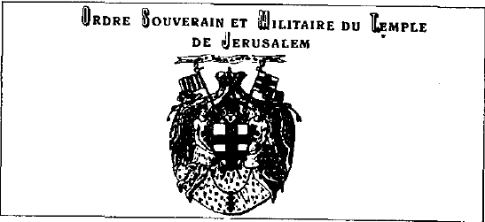

他们通常具有双重职能。一方面，他们秘密收集关于自己朋友和敌人的信息；另一方面，他们为客户处理所谓的“肮脏差事”。这些是“普通人”不应该知道的事情。因此，对这些情报服务的控制，是获得并维持对权力进行有效掌控的必要条件。这一点适用于所有国家体制，无论是民主的还是极权的。当情报机构开始脱离指定的领导者而自行其是时，末日的开端就近了。政治、经济与军事当局同情报机构之间的高效合作，是一个稳定国家的基础。但还有更多：国家要么依靠自己的情报服务而生，要么被其拖累，或者依赖其“朋友”的情报服务。

给伯爵的信息？

{style="width:3.23611in;height:1.48611in"}

苏萨·丰特斯（Sousa Fontes）——博达尔（Bodart）之首——的圣殿骑士团（Ordre du Temple）发展中最后一个重要阶段，似乎发生在比利时。1932年1月，技术代理约瑟夫·克莱雷芒（Joseph Cleeremans）、交易代理古斯塔夫·容克布洛特（Gustave Jonckbloedt）以及商务主任西奥多·科维亚斯（Théodore Covias）创立了“Association beige des Chevaliers de l'Ordre Souverain et Militaire du Temple”17（原文 beige 疑为 belge，比利时主权与军事圣殿骑士团协会）。仅仅一年后，该协会在比利时官方机关压力下被正式解散。但这并不意味着圣殿骑士团的终结。1936年，科维亚斯被任命为骑士团摄政。不久之后，科维亚斯的同伴埃米勒-克莱芒·范德贝格（Emile-Clément Vanderberg）接任此职。随着战争在望，骑士团的权力与档案最终被移交给当时摄政的父亲——唐·安东尼奥·坎佩洛·平托·德·苏萨·丰特斯（Don Antonio Campello Pinto de Sousa Fontes）。唐·安东尼奥于1942年正式被任命为摄政。1960年他逝世后，唐·费尔南多（Don Fernando）

坎佩洛·坎佩洛·平托·佩雷拉·德·苏萨·丰特斯（Campello Campello Pinto Pereira de Sousa Fontes）最终掌管了一个高度国际化取向的组织，该组织官方自称“Ordo Supremus Militaris Templi Hierosolymitani”（拉丁原名：耶路撒冷至高军事圣殿骑士团）。