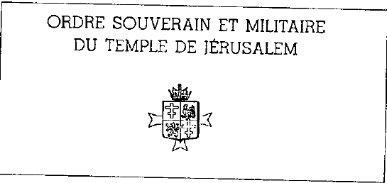

梦想是一种欺骗

{style="width:3.22222in;height:1.52778in"}

我只有一匹老马可以干活，我的铠甲不闪亮，我的剑也不是用最好的钢打造的。如果你们不怕沼泽与荆棘，就跟我来，我们会找到恰当的言辞。加入 Chevaliers du Temple（圣殿骑士）。他们已经耗尽了那么多老马，也折断了那么多劣质的剑。我认识他们；他们的功绩在于他们真正活过生命，而他们的幸运在于不必被生命所迫害。今天，骑士可以准备明天。你，我的弟兄，你是否正与那位建筑师一起寻找，想让他教你用什么材料来建你的拱门？你们难道不想为自己和孩子们造一艘坚固的船，驶向水瓶座之海吗？因为如果你认为当今的骑士精神主要需要一些纸条来拯救你，那你就错了。未来的材料不是待售的，它们由新的光组成，并在兄弟情谊中编织。我们想要建造的那些 Arches（拱门）将会与它们的用途相适应。如果你看到一位 Frère（兄弟）冲入黑暗，帮他擦亮他的

镜片，但要知道，这需要人的温暖，一撮爱心和一点谦卑。— Sire du Pavay de Lamart，Chevalier de l'OSMTJ（OSMTJ 骑士，OSMTJ = Ordo Supremus Militaris Templi Hierosolymitani），载于 'Organe Officiel de l'OSMTJ Grand Prieuré Autonome de Belgique'，第1号，1978年2月。

集合地点是 Charles Dupret 街的 café Albert 1，它是 Place de la Basse-ViIIe 广场的一条侧街。Charleroi（沙勒罗瓦）人很多，这座城市让我觉得令人厌恶而丑陋。然而，阳光弥补了许多。这里下雨的时候一定很悲凉！我在酒吧招待员那里登记。“M. Vanderstock 马上就来”，他说。咖啡馆很棒。

一个已经坐着的男人平静地向我走来。“你愿意跟我来吗”，他礼貌却坚定地劝说。我照做了。通过一段木制楼梯可以到达一楼。随后我听到 M. Tempel'idder 敲了一扇门。门从里面打开：可以进去。我很惊讶：这是骑士团的大厅。
