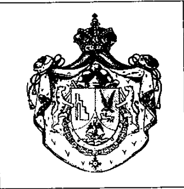

莫克特苏马的复仇（La vengeance de Moctezuma）

{style="width:2.125in;height:2.19444in"}

如果墨西哥人民召唤我，我愿意为祖国流血，并登上我祖先的王座2'' 这个词是“流亡中的阿兹特克之王”、“殿下皇家及帝国殿下，吉列尔莫三世亲王 (Prince Guillermo III de Grau-Moctezuma-Rifé)，Vei-Tlaotani del Anahuac（阿纳瓦克的大统治者）”。这个阿兹特克人真是一个传奇人物！谁曾想到那些战士印第安人，那些来自本地

神话中的阿兹特兰（Aztlan），今天竟然还会有一位王室后裔？谁又能想到现在竟然还活着一位 Tlahtouani（“国王”），在多年之后仍希望登上特诺奇蒂特兰（Tenochtitlan，今墨西哥城）的王座？阿兹特克国家不是在1520年被西班牙征服者科尔特斯（Cortéz），在受到阿兹特克威胁或恐吓的部族支持下摧毁了吗？“发生在我人民身上的，是一场谋杀”，亲王解释道3。

吉列尔莫三世亲王（Prince Guillermo III）享有一定的声望。从他在安道尔和巴塞罗那的“流放之地”里，他领导着一个真正的外交机构。世界各地——只要你认真寻找4——都可以发现他的领事馆和大使馆。例如在比利时，罗杰·尼塞特（Roger Niset，“瓦列索诺拉伯爵”）是其大使，西尔韦尔·勒邦（Sylvère Lebon）则是莫克特苏马的领事。但吉列尔莫的主张并未被所有人承认5。

没有任何政府、任何合法王室与此有任何关系。甚至西班牙贵族完全无视吉列尔莫。有些人甚至说他是一个幻想家、一个神话狂（mythomane，爱编造传奇的人）以及一个窃贼！

我们的“gel”基于什么？你名叫 Guillermo Grau，而你想要点什么！人这一生如何出路？变得富有太无聊，太过平凡。这是需要的，这是需要的，但又如此匿名\... 为什么不去当国王？问题是：并非人人生来就是王。然而，还有一招可以调整：只需改写你的谱系，并确保你不会把现存的王室都得罪得把你套上绞索。结论：找一个已经消失的王室，在历史里找到一个空白，然后尽情幻想。

