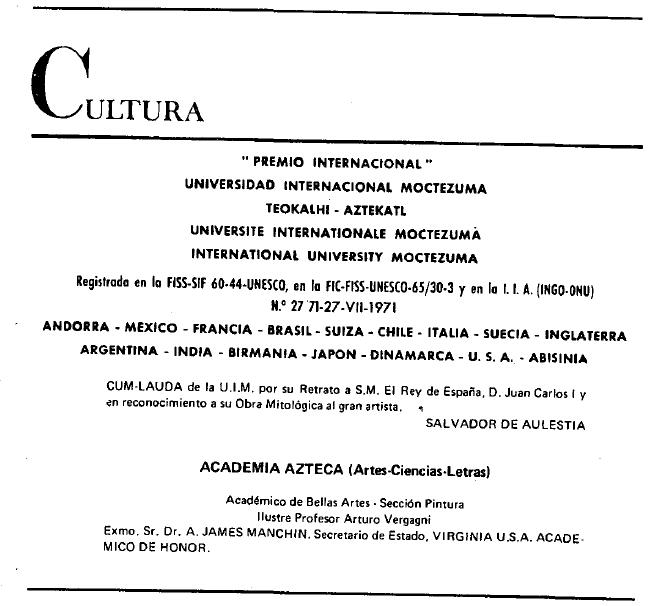

想想“月亮教派”。也有一些团体，乍一看追求的目标似乎相当无害，因此并未被界定为一个“邪教”。如果对这样一个组织的幕后稍作观察，就会发现其内部存在安全部队，那事情就严肃了。国际性运动“Nouvelle Acropole”（“New Acropolis”新雅典学派，1957 年由阿根廷人 Jorge Ángel Livraga 创建，原文作 lorge Angel Livraga）拥有安全部队这一事实，已被记者 De Meulenaer 在 1985 年 2 月 14 日法语周刊“Le Vif”（《Le Vif》）发表的文件所证实。New Acropolis 活动遍及 29 个国家，其中包括比利时。它自称是一所“思想学校”、“积极哲学学校”，要回答关于人、人之本质以及人之宿命的问题。为此，Nouvelle Acropole 组织有关艺术、古代文明、科学与哲学的课程。这些课程由其领导者 Jorge Ángel Livraga 设计。

Jorge Ángel Livraga：“当人们承认灵魂没有年龄，并且只要践行青年理想就永远年轻；当人们承认可见与可测量的只是不可见与不可度量之物的阴影；当人们将心智置于物质瞬息变化之上；当人们认同这一切……那么，你就是‘新人’。”9。壮丽。然而最终究竟是什么？在该运动高尚意图背后隐藏着一个带有军事外观的结构。Nouvelle Acropole 安全部队公告（Bulletin du Corps de Sécurit6）说：“我们当然还远未达到帝国罗马近卫或拿破仑军队的程度……但我们必须知道，我们是二者的胚胎，总有一天安全部队也将成为一支伟大的军队，一股伟大的力量……”安全部队的直接目标是确保内部秩序并保护 Akropolitan（阿克罗波利斯运动相关）人员与财产。精神目标是培养骑士——为理想服务的英雄且不可动摇之人……随着时间推移，将通过发展“作战小操队”（Maniples Opératifs，罗马军队的一个单位，作者注 fld）来拓展一套行动范围，它们将在不同领域实施预防性行动：火灾、骚乱、盗窃以及各种形式的暴力。它们还将与一个子结构协同：圆桌骑士（Chevaliers de la Table Ronde）。

辛辣的细节。1983 年 8 月，秘密的新纳粹民兵组织“Westland New Post”登上报纸头版时，事实证明 New Acropolis 与其并不遥远。日报《Le Soir》记者 René Haquin 透露，Westland New Post 的“大学”——名为 CEDIRE——其总部就设在当时位于伊克塞尔（Ixelles）Troonstraat 的 New Acropolis 场所内10。该民兵成员上过“凯尔特哲学”、普通哲学以及炼金术课程。

New Acropolis 过了一段时间在一篇“Droit à la Réponse”（“答辩权”）ll 中称，《Le Vif》的文章一点也不客观。受到批评的并不是关于秘密内部军事结构的揭露，而是记者谈及启发者 lorge Angel Livraga 的方式。对他缺乏足够的尊重！Nouvelle Acropole 愤怒地写道：Livraga 是一个值得钦佩、拥有资历（references）的人。毕竟，他拥有“Aztec Academy of Arts, Sciences and Letters”（阿兹特克艺术、科学与文学学院）的哲学博士学位。Livraga 是哲学领域的合格权威，值得被倾听。毕竟，他著有大量哲学著作。“Aztec Academy of Arts, Sciences and Letters”实际上是“Universidad Internacional Moctezuma”（莫克特苏马国际大学）的一个附属机构，由 Guillermo III 创立，以便出售大学学位以及骑士勋章与贵族头衔。只需一百美元，你就已经走得很远……Y。也许有些人只是幻想中更“贫穷”。

{style="width:3.90278in;height:3.59722in"}

