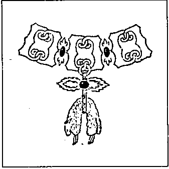

西班牙国王胡安·卡洛斯 (Juan Carlos) 与希腊王后索菲娅 (Sophie) 的女儿埃琳娜公主 (Princesse Elena)，生于1963年，将是一个很好的庆典契机。波旁 (Bourbon) 王朝与哈布斯堡 (Habsburg) 王朝的重新融合打开了许多可能性……

西班牙波旁家族与奥地利哈布斯堡家族之间的竞争与嫉妒由来已久，并非今日才起。这也反映在世界上最负盛名的骑士勋章的两个分支中：金羊毛勋章 (Ordre de la Toison d'Or)。胡安·卡洛斯 (Juan-Carlos) 是西班牙分支的大团长。奥托·冯·哈布斯堡 (Otto von Habsburg) 领导奥地利分支。奥托所掌管的“最尊贵且主权的金羊毛勋章”几乎是其政治组织之上的一个上层结构。它有一个非常明确的目的。

金羊毛勋章 (La Toison d'Or)

{style="width:2in;height:1.98611in"}

很久很久以前，有一位王子伊阿宋 (Jason)，他驾驶自己的船阿尔戈号 (Argo) 远航大海。他从希腊北部的伊奥尔科斯 (Iolcus) 航行到黑海东岸的科尔喀斯 (Colchis)，在那里获得了金羊毛 (la toison d'or)。伊阿宋的父亲、伊奥尔科斯国王埃宋 (Aeson) 被剥夺了权力，只有金羊毛才能让他重新登上王位。与他的海员伙伴们——阿尔戈英雄 (Argonautes) 一起，伊阿宋经历了奇妙的冒险。这些英雄中包括半神：赫拉克勒斯 (Héraclès)、忒修斯 (Thésée) 和佩琉斯 (Pélée)，他们必须承受可怕的危险。当他们的船通过博斯普鲁斯海峡 (Bosphore) 时，曾解救失明的菲纽斯 (Phineus) 国王，使其摆脱哈耳庇厄斯 (Harpies)——那些破坏他餐食的怪物之祸。经历漫长而充满奇遇的漂泊后，阿尔戈英雄们到达了科尔喀斯，那里有金羊毛——一张金色的羊皮。但首先，伊阿宋必须把喷火的公牛套到犁上，耕一块田并用龙牙播种。然后，等待他的是与守护金羊毛的巨龙的战斗。在女巫美狄亚 (Médée) 的帮助下，伊阿宋完成了他的旅程。伊阿宋终于获得了梦寐以求的金羊毛，随后又经历了更加不可思议的冒险，携它航回伊奥尔科斯，他的父亲在那儿等候。

这段希腊神话传奇是金羊毛勋章 (Ordre de la Toison d'Or) 的起源。一个具有强烈基督教灵感的骑士团竟然最初建立在如此“异教” (paganistique) 的故事之上，这似乎不太可能；看上去充满矛盾。然而，十五世纪——该勋章创建的世纪——正是一个将基督教价值与“异教”传统混合成特殊宗教结构的时期。不久，骑士们意识到他们的显赫骑士团竟然基于一个颇为可疑的故事——一个不够圣洁的故事。于是他们转向圣经神话。以色列在王时代之前的首领基甸 (Gédéon, Gideon) 也拥有一张金色羊皮。他受耶和华 (Jéhovah) 之命抵御骑骆驼的米甸人 (Madianites)，这些是他人民的敌人。为确信自己的神圣使命，他让耶和华施行奇迹：在干旱中，羊皮仍然湿润；在露水弥漫时，羊皮却保持干燥。确信自身的神圣任务后，基甸便英勇地击败了压迫其人民的米甸人。这后一段故事当然更契合该骑士团的基督教性质。尽管如此，伊阿宋 (Jason) 仍与基甸 (Gideon) 一同作为勋章的守护者。22.

1430年1月10日星期二，值其与美丽的葡萄牙的伊莎贝尔 (Isabelle du Portugal) 成婚之际，勃艮第公爵腓力善人 (Philippe le Bon, 1396-1467) 在布鲁日正式创立了“崇高的金羊毛勋章”。在婚宴期间，腓力的纹章官忽然庄严地站在右侧，提高嗓音宣告：“诸位王子与公主，诸位先生、女士、骑士与侍从请倾听。至高、至卓越、至强大的王侯，我的主人勃艮第公爵，法兰德斯 (Flandre)、阿图瓦 (Artois) 与勃艮第 (Bourgogne) 伯爵，纳慕尔宫廷伯 (Palatin de Namur) 等，为了上帝的荣耀与我们基督信仰的维护，为了尊崇并聆听高贵的骑士精神，同时基于以下三重理由：首先，为了向那些因其崇高而高尚的行动理应受到赞誉的古老骑士致敬；其次，使得今日正值壮年、并每日践行骑士行为之人，以更进一步精进为目标；第三，使后来被提及之勋章的佩戴者——也即那些佩戴它的人——被引导从事高贵的行动，并学习其礼制，使其能够凭借勇气赢得良好声誉，并从而有资格被择选佩戴此勋章；今日上述公爵宣布建立一个名为‘金羊毛 (la toison d'or)’ 的勋章；这包括与、并在公爵本人之侧的二十三位骑士，皆为具名与声望、无污点、合法婚姻所生并受教养之贵族，其姓名随后列出。”23.

