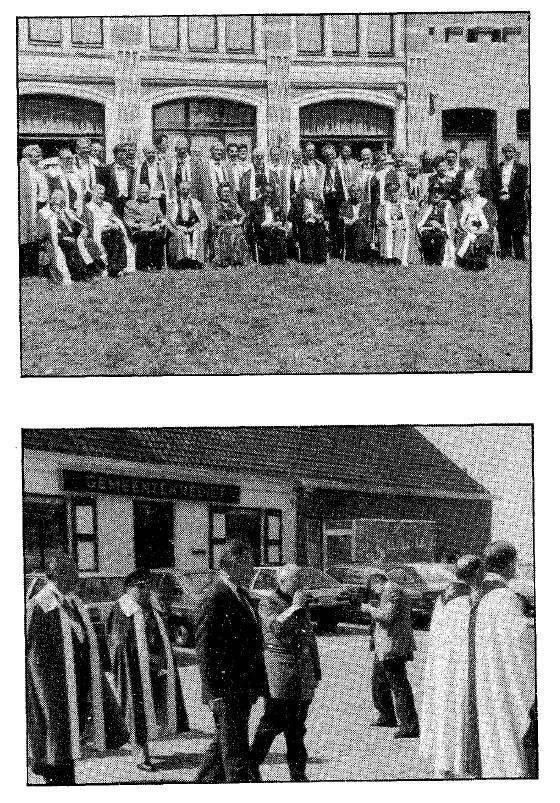

_______________________________________________

6.  Les Chevaliers de Saint-Jean（圣约翰骑士团）

Chevalier, tenez-vous droit !（骑士，站直！）

烈日照耀着西佛兰德省的 Moerkerke，天气非常炎热。除了耶路撒冷至上主权圣约翰骑士团（Ordre Souverain de Saint-Jean de Jérusalem） 的武器大师 Bockstal 之外，教育部长 Daniel Coens 庄重地退下，双手交叉，神情恭敬而略显憔悴。庄严的仪式性行列把你带入 Moerkerke 的街道。队伍最前面，两个装扮成中世纪人物的人艰难地挪动着步子。在他们身后是合唱团 “Die Cierlycke”，低声谦逊地歌唱。合唱团成员身穿黑衣。Coens 部长领着骑士队伍——二十来个男人和一名女性——他们都披着鲜红的斗篷，胸前有一枚巨大的白色马耳他十字（croix de Malte）。这是一场时空错置的景象。“这里的居民不明白这一切，”一位 Moerkerke 的居民说，“这事对他们来说太遥远了。”你会看到：教堂里顶多只有五个本地的“殉道者”（martyrs），其他的全是外地人。黑红相间的“蛇”缓缓摆动着朝圣狄奥尼索斯（Saint Dionysos）教堂的正门移动，几位神父和出乎意料众多的公众在那儿等待着骑士。所有人都立刻端正起身，惊叹不已，恭敬地等待即将发生的事情。

合唱团仍在歌唱，转入教堂回廊（déambulatoire）。Coens 部长和骑士们穿过由比利时海军一个小分队组成的荣誉道，坐到前排为他们预留的座位上。突然，所有声音静止。

{style="width:3.31944in;height:4.76389in"}

