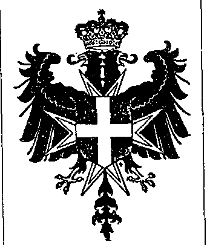

仿佛什么都没有发生——反正也确实什么都没发生——节庆的宴席继续进行。我又收到一份“Moka”咖啡，配上“Mignardises”（法语：小甜点）这些甜味小点心，上桌了。为这场筵席画上一个名副其实的终曲。

现在大概是“halfacht”（荷兰语 half acht：七点半）。宾客们起身，开始向骑士们道别并感谢这场盛大的宴会。来年再会。经过两小时的礼拜和五小时、按每小时三百法郎计算的用餐，我也决定回家。一出城堡，我便感到从那种强迫的、防御性的、高傲的气氛中解放出来。松开领带，长舒一口气。在火车上，这段古怪的体验仍在脑中闪烁。头痛。列车被度假者挤满，他们可以在海边度过一个周末。到处我都看到烧得焦红的红肉。明天会疼的，肯定…… 1

次精英（Sous-élite）

{style="width:2.02778in;height:2.40278in"}

在这种情况下，做一个骑士意味着什么？我不禁自问。是不是意味着属于一个精英群体，正如罗拜伊斯（Robaeys）在莫尔克尔克（Moerkerke）分会中所表达的那样，以比喻方式重新握起利剑，与“非道德的”、“反基督的”作斗争？所谓骑士传统里的礼貌、荣誉或体面，也许也扮演着重要角色，尽管塞万提斯（Cervantès）在《堂吉诃德》（Don Quijote）中已对其作了彻底终结。一个外行人试图理解。我注意到：圣约翰骑士能够把他们灰色的脑组织转换成一个简单但连贯、僵硬而自信的思维体系。佛兰德（Flandre）引述那句精彩的长着翅膀的格言：“mon ame a Dieu, mon epee au Roi, mon coeur a Madame et mon honneur a moi”（法语：我的灵魂归于上帝，我的剑奉献给国王，我的心献给夫人，而我的荣誉属于我自己）时的那种确信感，在这方面颇具意义。现在的骑士精神被一层奇特的酱汁所覆盖：尊重权威、忠诚与虚荣的混合物。

热拉尔·西蒙斯（Gérard Simons）也出席了莫尔克尔克分会。西蒙斯，安特卫普民俗博物馆负责人、耶路撒冷圣约翰主权骑士团佛兰德分修院（Prioratus Flandriae，正式名称）骑士，是一个诚实且极其彬彬有礼的人。他思考得很深入。这也是一种施予的喜悦。不被物质主义的紧身衣束缚。骑士精神包含某种对“凡事都要带来收益”心态的服务式回应。例如，我们支持或曾支持纳匝肋小姊妹（Petites Sœurs de Nazareth）、菲尔·博斯尼安（Phil Bosnians）的“无名联合会”（Union Without a Name）、德兰修女（Mère Theresa，Mother Teresa——她在我们的骑士团中也是一位伟大的女士）等慈善事业。这种服务也在个人层面上体现。因此在民俗博物馆里，我会尽我所能帮助每一个人。这是我作为骑士的职责。

西蒙斯叹息道：“骑士身份意味着一项艰难的任务。这是一个承担责任的选择。做骑士也意味着对传统的理解、对权威的尊重、对社会秩序的尊重。”他补充说：“因此，骑士团面向社会中特定的精英：律师、医生、外科医生、工程师、教授。总之，是那些负责任的人、散发权威与受人尊敬的人、对传统与文化抱有偏爱的人、愿意为一个建立在基督教基础之上的更好社会而工作的人。这样的人并不多。我们也非常有选择性。目前佛兰德修院里只有三十来位骑士。 2

在怎样的政治圈子里你会发现他们，可以说是‘高尚’的？一个以基督教价值与传统为基础的社会理念，当然也必须在政治上有所体现。政治党派偶尔会挟带骑士理想招摇这一事实，那就必然被忽视。尽管如此，与骑士团理念最接近的政党无疑是基督教人民党（Parti du Peuple Chrétien，CVP），尤其是其传统主义派。以下这些骑士首领是否不是很典型？有弗朗茨·范·多尔普（Frantz Van Dorpe），他在战后 CVP 内代表着极端亲利奥波德（ultra-léopoliste）路线。利奥波德三世（Léopold III）必须并且将要重新夺回王位。范·多尔普是左翼“红色法西斯”（fascistes rouges——他对反对利奥波德回归者的描述）的敌人。1965 年，弗朗茨·范·多尔普成为圣尼克拉斯（Sint-Niklaas）CVP 市长；1954 至 1981 年，他是具有 CVP 精神的信贷银行（Kredietbank）董事兼管理委员会成员。他还在佛兰德企业家组织 V.E.V.（Vlaams Economisch Verbond，佛兰德经济联盟）以及多家企业中担任非常重要的领导职务 3。范·多尔普属于西蒙斯所说的那种精英。还有约瑟夫·道韦（Jozef Dauwe），现任骑士团大臣。律师道韦被视为登德尔蒙德（Dendermonde）地区一位崛起中的 CVP 人物，他也是该地区的区级律师。teel 是 PDC（应为 CVP 相关组织，原文可能有误）党的秘书以及众议院的候补成员。
