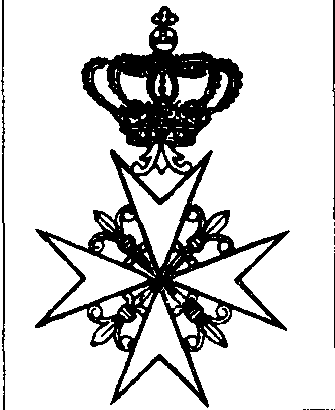

莱茵骑士团的全球帝国（Rhin Order）

{style="width:1.98611in;height:2.43056in"}

他在1799年10月27日那天一定欣喜万分。俄国皇帝觊觎耶路撒冷圣约翰骑士团（Ordre de Saint-Jean de Jérusalem）的“大团长”职位并不只是“为了一口饭”。这个职位既能抚慰他的虚荣，又能嵌入他与法国革命派的政治博弈。那年十月，被主要是俄国骑士——还有一些自马耳他逃离的骑士——选举为大团长之后，沙皇保罗一世（Tsar Paul I）似乎立刻与之缔结了永恒的联系。挂着他身着大团长礼服的肖像画在巨大宫殿的长廊里徘徊，据说如此。也许正是沙皇专横且带有精神病态色彩的性格，构成了这段离奇故事的底色。教皇庇护六世（Pius VI，任期1775–1799）强烈抗议保罗的当选：一个东正教徒怎么能成为纯天主教骑士团的首脑？此外，沙皇已婚，并且从未在该团中被正式授衔为骑士，章程被彻底颠倒！但庇护六世权力已极其有限。拿破仑剥夺了他的主权，并把他关押在瓦朗斯（Valence）的监狱。保罗的另一位对手费迪南德·范·洪佩施（Ferdinand van Hompesch）也无力改变这一切。作为

第71任大团长，这场“背叛”被摆上了明面。据说他曾秘密将马耳他岛“出卖”给法国革命者。骑士们的处境一天天愈发暧昧不清。

尽管这些争吵不断，保罗一世获得的支持却越来越多，甚至超出了俄罗斯的疆域。他在自己担任大团长期间设定目标：把马耳他岛重新交还给骑士团。沙皇想要一石二鸟：一方面给他新近获取的光辉头衔再添几分荣耀；另一方面让马耳他成为俄罗斯的某种附庸国家。因为沙皇，即便性情乖张，也早已看得很清楚：马耳他过去是、现在仍是抵御中东方向威胁的战略堡垒。

1800年9月5日，纳尔逊（Nelson）从法国人手中夺取了该岛。
