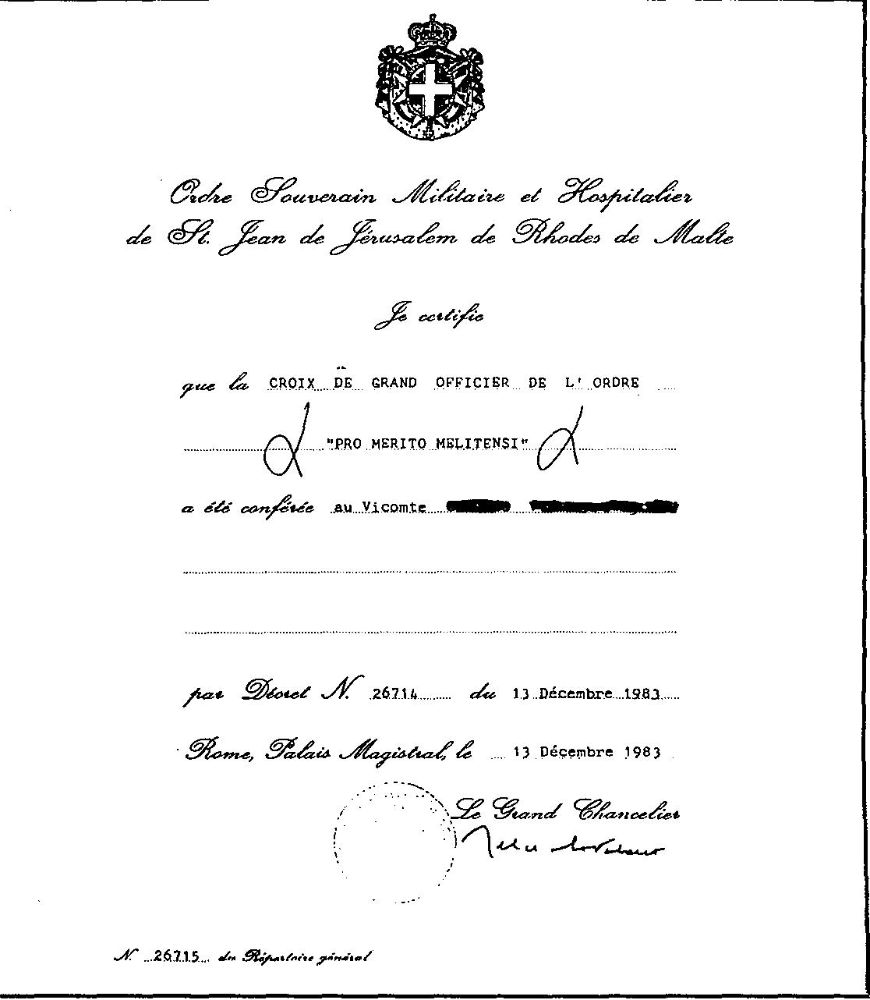

因为在1984年一封正式公文中，比利时外交部仍然声明：“尽管有一些勋章可以由平民与军人佩戴，马耳他修会 (Ordre de Malte / SMOM) 并未获得比利时政府的承认。比利时主管当局与该修会所谓的主权之间只有非正式接触。” 58 .

“Promouvoir la Gloire de Dieu par la sanctification de ses membres, des services rendus par la foi et le Saint-Siège, et de votre aide au prochain, conformément à ses traditions séculières”——“通过成员的成圣、以信仰与圣座所提供的服务，以及你们对邻人的援助，来促进天主的荣耀，并遵循其数百年传统”——这，正如骑士们所说，是其目标 59。为此，在这些含糊城墙之后，有重要的联系线通向比利时王室、比利时天主教会以及仍具影响力的“王室与殡葬诸侯之家”(maisons princières et funéraires)。似乎在骑士圈子内部，旧制度 (Ancien Régime) 的古老传统与原则经受住了时间考验。更甚者，看起来那种在这些圈子里“祭司权 (sacerdotium)”与“帝权 (empire)”——主教与诸侯——之间的微妙关系又一次被磨砺。教会与国家的统一，归于天主之荣。这就是理由吗？

相关的石碑与所谓的王室“诸侯之家”是比利时国家的支柱。他们始终与王室紧密相连；他们在比利时王国成立之初就已在场，并且至今仍在很大程度上控制着这个国家 60 。想想 Merode、Liedekerke、Ligne、Croy、Limburg-Stirum、d'Oultremont、de Jonghe d'Ardoye 等家族。其家族宗主无一例外皆为骑士。这些家族象征着比利时天主教顶级贵族 (top-adel) 的精英之巅。虽然他们的政治同情主要偏向天主教社会党 (CPS) 的右翼，但这些家族后裔的贵族如今已超越了具体的政党火炬。从他们壮丽的城堡中，他们俯瞰自己的猎场——比利时——甚至通过广泛的家族关系网络影响整个欧洲。正是这些隐形的女士与先生们，凭借他们在比利时的金融实力，操纵着国家社会—经济与政治的诸多线索 61 。这种微妙的工作是通过一种社会结构完成的——当然脆弱——名曰民主。

1950年11月15日，国王博杜安 (Baudouin) 被授予“荣誉与虔敬大十字执事 (bailli Grand-Croix d'honneur et de dévotion)”；1959年7月2日，阿尔贝王子 (Prince Albert) 亦获此荣衔。通往王室的联系由此加强。与比利时天主教会的关系当然也是头号优先。1962年6月4日，比利时前任主教会议气候掌舵者红衣主教苏宁斯 (Cardinal Suenens) 成为“荣誉与虔敬大十字执事”。现任领袖红衣主教丹尼尔斯 (Cardinal Danneels) 于1983年3月25日获此荣誉。简而言之，记者 Walter De Bock 写道，在我国，马耳他修会 (Ordre de Malte / SMOM) 也按同一概念运作——这一概念几个世纪以来在各国皆如此。

Bock：“在我国也是，马耳他修会按照历经数世纪于各国所运用的配方运作。这里亦是，一个低调却有影响力的‘神圣三位一体’：王室、教会领导与大贵族——恰好对应那个教会与国家尚为一体的罗马时代的三种构成。” 62 . 不可能，你会说，神圣罗马帝国、旧制度，那些不过是彻底过去的结构。

{style="width:5.83333in;height:6.69993in"}

启示录之兽

为结束本章，我想再引述几件奇特之事。我们回溯到二战前夕。1937年12月从罗马马耳他宫 (Palais de Malte) 分发的 SMOM 内部及国际期刊中，包含一段格外有趣的文字。那是西班牙分部 SMOM 的“传达员—主席”(huissier-président)——瓦列利亚诺伯爵 (comte de Vallellano) 所立的一则誓愿。
