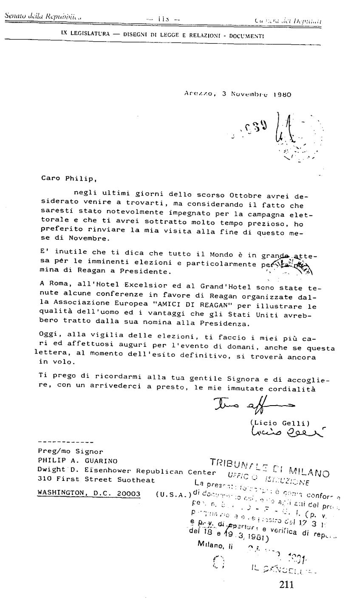
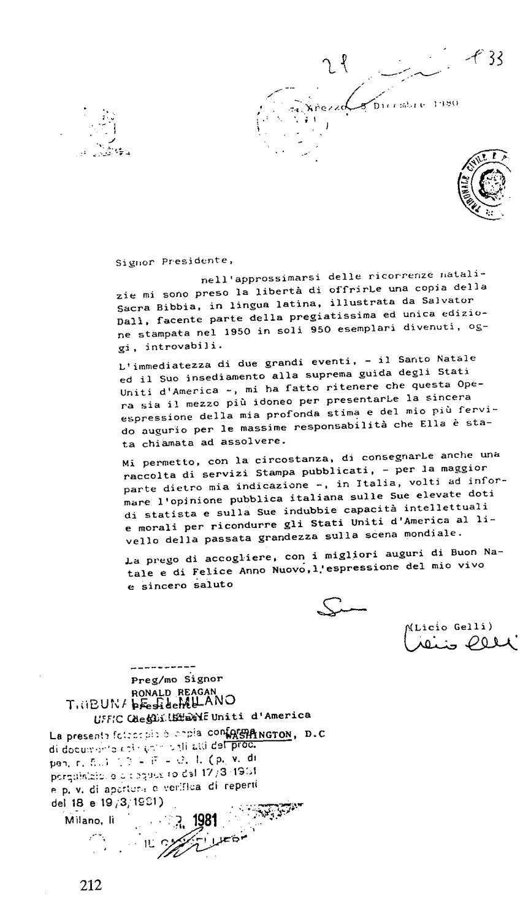

{style="width:4.90278in;height:8.44444in"}

{style="width:5.13889in;height:8.68056in"}

亲爱的 Philip（菲利普），

在刚过去的十月最后几天里，我本想前来拜访您，但考虑到您当时深度投入竞选活动，而我会占用您大量宝贵时间，我决定把来访推迟到本十一月月底。

毋须多言，整个世界都在高度关注之中。大家都在等待即将到来的选举，尤其是里根（Reagan）对总统职位构成的威胁。

在罗马的艾克赛尔西奥酒店（Hôtel Excelsior）和大酒店（Grand Hôtel），欧洲协会“FRIENDS OF REAGAN”（“FRIENDS OF REAGAN”——里根之友）已举办多场支持里根的会议，用以阐明此人之品质，以及美国在他被推选为总统后可能获得的种种益处。

今天，值此选举前夕，谨向您致以祝愿：预祝明日之事一切顺利、好运常伴。尽管当这封信被阅读时，最终结果或许已尘埃落定，它仍承载着我这份心意。

请代我向您那位亲切的夫人（gentille Dame）致意，并请收下我始终不变的诚挚问候与告别。