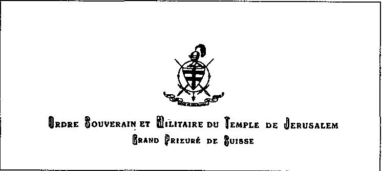

La Nouvelle Jérusalem

{style="width:4.41667in;height:1.97222in"}

人们当然知道圣殿骑士团（Ordre du Temple）确实与 P2 有联系。在比利时也有。尽管 Zappelli 否认了。由于圣殿骑士团涉入共济会（franc-maçonnerie）圈子，一些骑士于是辞职。但是缺乏具体、确凿的证据与名字。现在我看到你的分析…… 可惜我们以前不知道。我的联系人绝望地摇头。他叹了口气。

服务员端来了点的餐。我突然注意到小男孩和他的祖父已经不见了。时间已晚。夜幕降临，酒吧里的气氛明显发展起来。人们说笑，安全地待在这家公司/场所里。

“谜团……”，前圣殿骑士（ex-Templarier）感叹道，“确实有，但并不是我所想象的那样。在我头顶之上，发生过奇怪的事情…… 我听说过在摩洛哥（Marrokko）尝试建立自由区（zones franches）的事情，例如…… 但你怎么看？” 前圣殿骑士从公文包里翻出一封信，由圣殿骑士团摄政（régent）苏萨-丰特斯伯爵（comte Sousa-Fontes）所写。Sousa-Fontes 致信“阁下”（Son Excellence）Zappelli。
