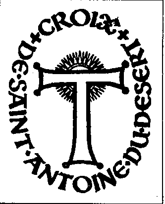

Marcos 是一位荷兰人，本名 Johannes-Maria Bloom van Assendelft。以这个名字，他在 SAC 事件3时期担任 Zdrojewski 的圣殿骑士团 (Ordre du Temple) 荷兰代表！巧合吗？有人告诉我 Zdrojewski 本人必定与 Saint-Jean-Baptiste 修会 (Ordre de Saint-Jean-Baptiste) 相关，而 Marcos 的“沙漠的圣安东尼修会” (Ordre de Saint-Antoine du Désert) 显然与其相关。巧合吗？而且还有后续。1980 年 9 月 23 日的一份通告，邀请 Saint-Jean-Baptiste 修会的骑士们参加 Mgr Marcos（Marcos 主教）关于科普特世界的一个讲座，并指出：“将在耶路撒冷主权军事圣殿修会 (Ordre Souverain et Militaire de Temple de Jérusalem) 中给予忠诚的弟兄一次晋升。” …… 圣殿骑士团的比利时分部由 De Bruyn 将军领导。他在 CAS 危机4时期是 Zdrojewski 修会的比利时代表。巧合吗？

在一封日期为 1983 年 5 月 9 日的信中，Zdrojewski 报告了与 Saint-Jean Baptiste 修会的良好关系，并确认 De Bruyn 将军为其比利时代表。Zdrojewski 自称为耶路撒冷主权军事圣殿修会的“欧洲大总长” (Grand Prieur Général pour l'Europe)。在 1983 年！这意味着当 SAC 涉入圣殿骑士团一事对所有人都变得清晰时，Zdrojewski 完全没有被排除。恰恰相反。除了 Zappelli 之外，Zdroyewski 似乎也在索取他在圣殿“蛋糕”中的一份。上述说法显然得到了 Johannes Maria Bloom d'Assendelft，也就是 Marcos 主教，以及 De Bruyn 将军的明确支持。和以前一样！

头部

{style="width:1.97222in;height:2.44444in"}

Marcos 主教令人肃然起敬。没有人能逃脱他那智慧而摄人的目光，它从他长长的灰色眉毛下射出。尤其显眼的是那一头长长的波浪状灰色头发。年逾七十的 Marcos 主教，是一位俊美的男子。看到他头戴包巾 (turban) 在 Finistère（法国布列塔尼大区菲尼斯泰尔省）庄重地执行仪式，令人印象深刻。