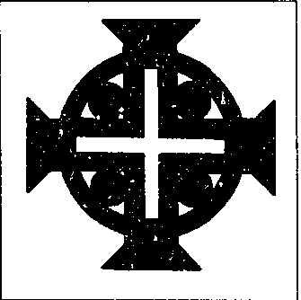

在结束第22章之前，我想问是否还有其他人愿意发言。大团长（Grand Maître）环顾四周。我会说些什么吗？不会，现在是让其他各个骑士团的首领用大十字勋章和头衔来向 Michaelite Chevaleresque Brothernite（迈克尔派骑士兄弟会）的大团长致敬的时候。授予的荣誉声明，大团长接受以示感谢。第22章就这样结束了。那时已近八点。仪式结束。门被打开。外面，各自的代表团在镜头前合影。随后敬酒（vin d'honneur），并加深彼此联系。所有人都同意：这是一场漂亮的仪式"。

我仍然感觉不到成为骑士的需要。但是这种崇拜（culte）触动了我。成年男人和女人跪着向一个骑士团（Ordre）及其首领忠诚宣誓……我做不到。那些男人自称华丽的骑士，身佩各种勋饰，庄严地与物质主义斗争，试图让人类的精神性占上风。这样的怪异仪式真的是我们这个复杂社会良好运作所必需的吗？也许吧。那么为什么我却没有这种需要？我得停止思考，把注意力放到道路上。我已经走过这条街两次了。这有帮助。过了一会儿，通往布鲁塞尔的路向我展开。

Fontaine d'honneur（荣誉喷泉）

{style="width:1.98611in;height:1.97222in"}

当 Michaelite Chevaleresque Broaternite（迈克尔派骑士兄弟会）的“大访问者”（Grand Visiteur）打电话给我预约——“大团长也会在场”——我相当惊讶。他说：我们会坦诚回答您关于本骑士团历史的所有问题。真有勇气，我心想。因为他们历史上的引用非常值得商榷。这个骑士团也被认为完全是幻想的。唯一被认可的圣米歇尔骑士团（Ordre de Saint-Michel）是1469年由法国国王路易十一（Louis XI）创立的，用以对抗声望卓著的“金羊毛骑士团”（Ordre de la Toison d'Or）。圣米歇尔骑士团是一个王朝骑士团，历史上属于法国王室（Maison de France）。
