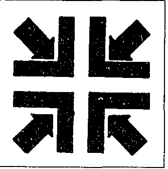

Don Quichotte（堂吉诃德）...

{style="width:1.98611in;height:1.98611in"}

Paul Neveux（亦称 Geniebre 男爵）创建了一个真正的20世纪骑士运动。这个人向许多骑士提供了一座“Fontaine d'honneur”（荣誉之泉），那是每一位骑士的骄傲。今天在全世界，成千上万的人把自己的骑士传承追溯到这位男爵，并通过他连接回中世纪时代。Paul Neveux 立即成为一系列骑士团的根基。他的弟子之一是“男爵” Jean Christini，后者于1947年创建了 Ordre de Chevalerie du Christ-Roi（“基督君王”骑士勋章）。Christini 又于1954年9月29日在比亚里茨（Biarritz）的圣文森特礼拜堂（chapelle Saint-Vincent）被封为骑士。Raoul Alibert de la Vallée，S.A.S. Ex. de Ridder Alibert de Brandicourt 的长子，作为阿利贝尔（Alibert）家族各支系的第一继承人，与我们至爱之夫人及妻子 Gilberte Marie-Anne Richard 的婚姻（于1933年4月18日在朱维西 Saint-Nicolas 教堂 consacrée）之下——la Maison et les branches de l'Alibert de la Vallée？Madness 3？无论如何，“Alibert de la Vallée 家族之首”成为精神或神秘骑士精神的拥护者。借助他的期刊 La Croix de Gueules（《La Croix de Gueules》，“gueules”为纹章学术语，意为赤红），首次出版于1957年，Alibert 设法使全欧洲此类骑士精神达成合作协议。这就是所谓的“友谊盟约”（pacte d'amitié）。Alibert 向这些骑士团提供了必要的精神食粮：关于生命深度的诗篇、对骑士精神过去、现在与未来的抒情倾诉、以及对圣经文本的浪漫离题……

然而，让这位已于1986年去世的精神领袖自己来说话。在题为“Fidélité, héroïsme, miséricorde”（忠诚、英雄主义、仁慈）的篇章下写道：“这里，正如自世界开始以来一样，白昼与黑夜、善与恶、天堂与地狱的战斗。它一遍又一遍持续着，而在这永恒战斗的最激烈之处，存在着 LES RIDDERS（骑士们）！当黑暗天使背叛 DIEU（上帝）并选择 LUCIFER（路西法）为他们的首领时，Archange Michel（大天使米迦勒——上述时代的冠军）身披对 DIEU 的忠诚站起，让 SATAN（撒旦）咬啃尘土。”

