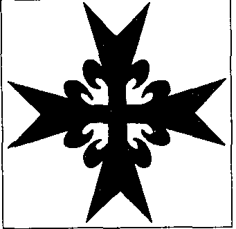

Pour la gloire de Dieu

{style="width:2.01389in;height:1.95833in"}

任何经过那里的人都会承认这一点。大学首先是一个培养人的地方。对人格发展产生重要影响的，不仅仅是研讨会或教授的课程。尤其是发生在纯粹教学之外的那些事——你建立的联系、人所拥有的自由与独立——会激发年轻、缺乏经验且天真的学生去思考人生的巨大奥秘：他是谁、他想要实现什么。这些都是艰难却值得的时刻。

在 1959-1960 学年，鲁汶天主教大学（当时仍是统一的）的一些年轻学生遇到了一篇文本，这篇文本深深影响了他们，这些学生受天主教精神（geln 原文保留）启发，且来自非常富裕的家庭。该文本由本笃会修士 Marie-Gerard Lafond（拉方德，Dom Lafond，"Milice Sanctae Mariae"（圣玛利亚军，保留拉丁原名）创始人）撰写，内容如下：我们相信，骑士精神的目标——促进基督教秩序以及在基督王国中的和平——比以往任何时候都更加现实。我们相信，为天主与人为之奋斗，是当今真正的骑士式战斗。这是唯一能够在它爆发的所有领域（首先也是最重要的，在精神领域）对抗隐蔽的物质主义和革命性暴力的有效立场。一个为了天主并反对物质主义的战斗单位式骑士团，像从前一样！这听起来颇具意义。怀着 Dom Lafond 的教导，决定很快作出：必须建立一个骑士团。名称：Ordre du Rouvre（卢夫尔橡木骑士团，Rouvre 为法语“古橡树”意，保留原名）。橡树是连接天地的象征性标志。一个等级结构被制定出来，三个等级——侍从（écuyer）、donner（原文保留，可能为赠与者头衔）、最后为骑士（chevalier）——的入会仪式窗口被设计并详细规定。最后，发起者们还设计了合适的服装。

这些发起者，尤其是 Richard van Wyck 和 Jacques Jonet 14，不久便能够依靠大学尊贵校长（recteur magnificus）主教 Van Waeyenberg 的不可或缺的支持。
