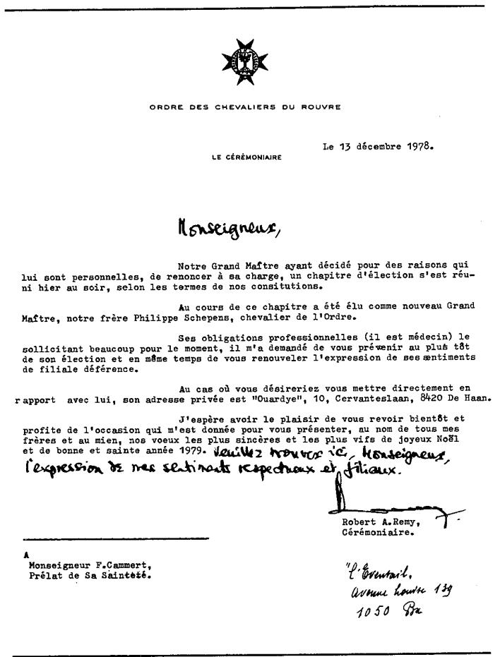

{style="width:4.19444in;height:5.51389in"}

大人物的游戏。若要了解大公及其支持者那种一丝不苟的工作方式，您必须经历若干步骤。“Mouvances”的战术极其复杂，难以跟进，但却卓有成效。眼前的是“Vde Congres ; 5,6 et 7 octobre 1973”（第五届大会；1973年10月5、6、7日）之“Associatio Benedictus Patronus Europae”（Associatio Benedictus Patronus Europae 协会，名称并不广为人知）项目。该第五届大会在马德里举行，由西班牙首席主教——枢机主教 Marcelo Gonzalez Martin 主持。演讲者包括：Marcel Clément（Cercle Violet 成员）、Paul Vankerkhoven，以及 S. A.I. et R. l'Archiduc Otto de Habsbourg（奥托·冯·哈布斯堡大公）。

