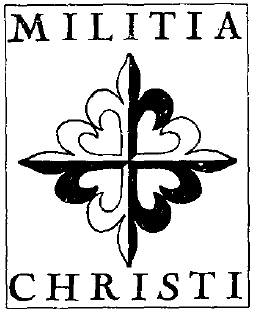

男爵同时活跃于哈布斯堡家族奥托大公的欧洲组织中，他对此予以否认，甚至向国家安全局总管理员提出了控诉。男爵宣称，这个机构已经被克格勃（KGB）特工彻底渗透。这是一个老生常谈的主题。第三次世界大战正在进行中，奥托大公会表示赞同。他或许是对的。否则，为什么像 CEPIC 或奥托的欧洲协会这样的受人尊敬的组织，会在纯粹军事化的方式上与极右翼的犯罪核心发生非常特殊的联系？更奇怪的是，在这些组织背后，总会出现一些神秘的骑士团，它们似乎构成了上层的神秘宗教框架，并传递其意识形态。幕后操纵的屏幕……

还有更多。还有一个更加神秘的（如果可能的话）骑士体系，再次印证了上述关系模式。它在几乎无法解开的纠葛中形成了一个新的未知环节。当我基于近乎机密的文件强调“Rouvre勋章（Ordre du Rouvre）”时，我写道该勋章与当时另外两个骑士团订立了一个“骑士契约”。其中一个被称为“Milice Sanctae Mariae”（圣玛利亚军团）。另一个自称“Milice de Jésus-Christ”（耶稣基督军团）……

异端者

{style="width:1.5in;height:1.83333in"}

在1981年由国家安全部门泄露的备忘录中，除了我们已经熟知的 CEPIC 旧人物之外，还提到了一个尚未讨论的名字：Bernard Mercier（伯纳德·梅西耶）。他曾是 CEPIC 执行委员会成员，并在1972年至1976年间担任 CEPIC 全国主席 André Saint-Remy（安德烈·圣雷米）的秘书。1982年，Mercier 像其他许多人一样加入了 Jean Gol（让·戈尔）和 Louis Michel（路易·米歇尔）的 LRP。