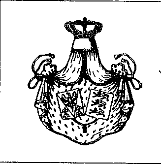

在滑动（社交穿梭）过程中建立起联系。我们的弓箭手

喀麦隆的那位先生高声宣称。他在那里做生意。喀麦隆并不

是一个落后的国家，那是一个美丽而极其好客的民族。名片

被交换。下周会有电话联系。一个

留着巨大八字胡的男人为他的公司做宣传，

据他自己声称，在修复工程方面极其扎实。

这是艺术，不是你，别怀疑！直到

现在我才明白这个“上流社会”圈子是怎样构成的。医生，

工程师、管理人员、注销员（公证人）点缀着城堡华美的厅堂。

他们以一种艰难的方式“自我推销”（近乎自我出卖）。这就是这场操作的目的吗？

Pax Mundi（拉丁语“世界和平”，组织名）主席、Chevaliers de la Paix（和平骑士团）大司祭、Confraternité Universelle des Cavaliers du Saint-Graal（圣杯骑士全球兄弟会）大司祭、Ordre Royal et Militaire de Saint-Gereon（圣格雷翁皇家暨军事骑士团）大司祭——乌尔班·迪里克斯（Urbain Dirix）在这项事业中如鱼得水。他握手、拍肩。女士们则接受手背吻礼。迪里克斯是毋庸置疑的领袖。仿佛他创建了这个小世界就是为了在其中游行。上流社会的忙乱里有某种人工造作，鼓胀的社交氛围带着模仿的味道。Gentlemen parade as god in the hinterland（绅士们在偏乡像神一样游行），忽然闪入脑海…… 事后我听说来场的并非大使本人，而是大使馆的高级职员及其配偶。怪异。

我怎么也联系不到迪里克斯。迪里克斯忙于他的客人。但那个穿黑色短袍的男人却只吊在吧台旁。“我是 Ordre Royal et Militaire de Saint-Gereon（圣格雷翁皇家暨军事骑士团）的传达官，”他自豪地说，“我们还不大，但等着看。只有重要人物才能成为我们骑士团的骑士。他们那时就承认我们皇帝的主张。我们的最高大师是 Caspis von Schwaben（卡斯皮斯·冯·施瓦本），施瓦本王位的觊觎者。就这些了。”一位被酒汽熏染的巴黎佳肴（比喻：醉醺醺的贵妇）把传达官从我身边带走。“哦，我的头啊，我的执达官（bailli）。”她叹息。

我决定停止喝伴随宴席的红酒。我很难忍住不笑出声。幸好还有司仪弗雷文（Vreven），为了“阁下们、女士们、先生们（Excellences, Mesdames et Messieurs）”的利益，宣布一个巨大的蛋糕，题名“San Gereone”，已经可以品尝。主教大人（Monseigneur，尊称）现在嘴里叼着那根永恒的雪茄，微微颤抖着走向大厅。酒已冲上脑门。显然大家很赶。即便在吃蛋糕时，弗雷文仍宣告：“阁下们，女士们，先生们，我们的沙龙乐队还将演奏两首曲子。随后您可以以民主的价格 400 F 购买乐队的唱片，当然有签名。这是对这奇妙夜晚的美好纪念。我感谢阁下们、女士们、先生们的到来，并希望在六个月后再次见到各位远道而来的朋友。谢谢。”

只剩下半打人。虚假的“上流嘴脸”还想继续。若干联合国国家的那位主教，向显要告别。我也决定退场。到城堡入口处，掌事者（maître d'hôtel）拦住我。我已经付过钱了吗？迪里克斯与弗雷文商议。他们说我得付。好，好，好。我独自一人。终于。我可以笑了。这一切究竟意味着什么？全都？一种精英式 Lyonsclub（应为 Lions Club，国际狮子会）吗，正如传达官告诉我的？二十世纪的骑士……

施瓦本人

{style="width:1.93056in;height:1.98611in"}

在意大利北部的贝尔加莫省，有一个特殊的男人居住。显然完全沿袭 Arlecchino 与 Brighella（即 Commedia dell'arte 意大利即兴喜剧中的丑角）的传统，这位特殊的贝尔加莫人可以委婉地被称作“皇家与帝国殿下，乔瓦尼·卡斯皮斯·冯·施瓦本亲王”（Prince Giovanni Caspis von Schwaben）。他自我呈现为 Schwaben（Souabe，施瓦本）王位的觊觎者——中世纪时位于德国西南部的一个公国。

在过于漂亮地罗列这位“施瓦本殿下”令人印象深刻的履历之前，先说明这一点。Giovanni Caspis von Schwaben，Ordre Royal et Militaire de Saint-Gereon（圣格雷翁皇家暨军事骑士团）的大师，同时也是 Académie Sainte-Irenée（圣艾琳妮学院）名誉委员会成员；该组织几乎在整个西方世界都有分支，并在众多学科出售“文凭”。这所学院的名誉委员会除了“主教与宗主教”外，也容纳“帝国殿下”们。我们那位阿兹特克王位觊觎者 Guillermo III de Grau-Moctezuma-Rife, Vei-Tlaotani del Anahuac 也在这个名誉委员会中。多么的世界，多么的“皇帝”！但现在，严肃一点：请参见所附文件。

