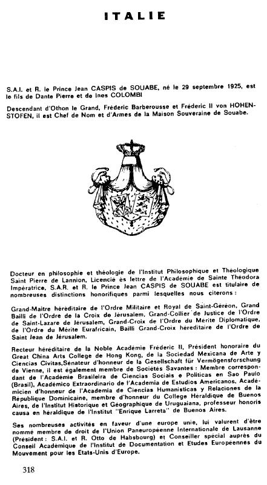

{style="width:2.61111in;height:4.75in"}当然，所有提到的那些奖项在官方层面都毫无价值。它们来自一个国际性的“假勋章、假学院、假大学”运作网络。例如，Son Altesse Souabe（施瓦本殿下）还是香港 Great China Arts College 的名誉院长——那所“学院”不过是某个办公抽屉里的纸面存在……幻想的玩味似乎永无穷尽。但最近新增的两个“加入”却令人惊讶。比如，“施瓦本殿下”怎么会出现在哈布斯堡泛欧联盟（Union paneuropéenne des Habsbourg）的奥托（Otto）那里？这可是很严肃的。有人在他位于贝加莫（Bergame）的寓所对我说：“Von Schwaben 是个正直的人，在那里他接待要人。”他为建立一个“基督教的欧洲”所表现出的热忱替他打开了许多大门。这位“王子”拥有追随者。

La vie et rose（生活一片玫瑰色；疑似 La vie en rose，意指“美好的生活”）

Étrange… Prince von Schwaben, Marquis Vella-Haber, Prince Bourbon y de Bourbon (Grand Maître d'un Ordre de Sainte-Lucie) 14, Marquis de Haro Union (王子的得力助手)：他们把那位外人列入“Pax Mundi, Académie diplomatique de la paix”（Pax Mundi 和平外交学院）的“Correspondants académiques”（学术通讯员）名单。“Pax Mundi”由意大利男爵 Dino di Stefano 于1963年创建，其人现已去世。

À la fin des années 70（70年代末），来自 Vanderberg 的男爵 Paul J. Cams 认为是时候出面领头了。这让他获得了国际声誉。他走遍世界，书写“文凭”，出售“CD”外交车牌，并分发“prix de la paix”（和平奖），因为“Pax Mundi”声称为和平而工作。值得注意的是，当时的副主席是 Dominique Ponchardier——凶名昭著的 Service d'Action Civique (SAC)（公民行动服务组织）共同创始人。另一方面，前佛朗哥政权部长、哈布斯堡欧洲政治协会成员 Alfredo Sanchez-Bella 似乎也在这个核心圈子里……Paul Cams 的确“交游甚广”。这些“和平奖”，或者称 Dag Hammarskjoldprijzen（以1961年在空难中去世的联合国瑞典籍秘书长达格·哈马舍尔德命名的奖项），曾颁给扎伊尔总统 Mobutu、菲律宾前总统 Marcos、西班牙独裁者 Franco，或者美国极端保守主义代表人物 Claire Booth Luce 等人……

尤其在非洲和亚洲国家，“和平使徒”的白色袍服过去并且现在仍被政府正式代表隆重迎接。那里，“chevaliers de la paix”（和平骑士）所享受的待遇堪比国家元首。

