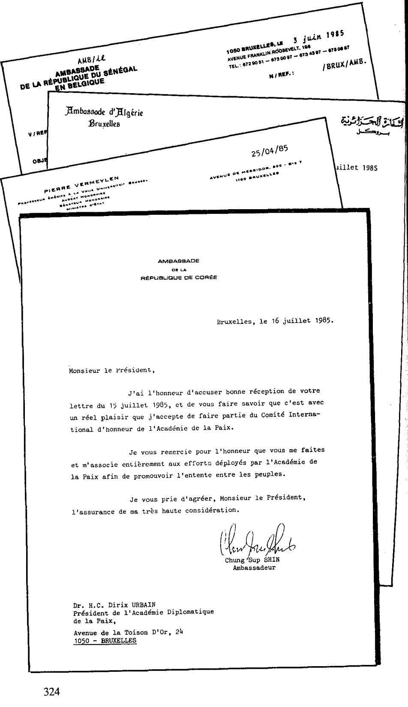

{style="width:5.59722in;height:9.68056in"}

Interlude I

人类物种的想象力是巨大的。我早已知道这一点。这段故事将走向何方……我不断从一个惊讶跌入另一个惊讶。但是我们不要跑得太快，也不要把碎片一块块地摊在桌面上。它正形成一枚奇怪的印记。

通过大司祭、侯爵 Vella-Haber 的引介，我来到了'Pax Mundi'（Pax Mundi）。尤其是那两位神秘的自学者 Paul Cams 和 Urbain Dirix 处于核心位置。在他们之间，我一度领略了'Impériale'（“帝国”）与'Royale'（“王室”）两个领域的氛围。当我读到 Vella-Haber 1979 年在 Zaventem（扎文腾，比利时）降落，并在一场庆祝活动上被迎接，随后被带到 Paul Cams 的 Nouveau Carlton（新卡尔顿饭店）时，一切就非常清晰了。这个 pseudo-doo（原文用语，可能指伪组织，语义不明）有坚实的国际基础。之后 Vella-Haber 又确认了与'Pax Mundi'以及其他学院、研究所和骑士团的关系。这些先生们很成功，并且在某些权力圈子的工作中广泛染指。这一点尤其令我震撼。而…………这还会继续让我惊讶。

1979 年，Vella-Haber 任命 Paul Cams 领导其比利时分部的“ … （原文未完）