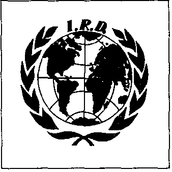

Le comte palatin（宫廷伯爵）

{style="width:2in;height:2in"}

在比利时东佛兰德省境内，在登德尔河畔、佛兰德阿登山麓，有一座名为 Geraardsbergen（赫拉尔兹贝亨）的城市。一座历史名城。你可以从那些历经世纪、见证辉煌往昔的建筑物中看出来。13 与 14 世纪时，作为登德尔河谷的终点，Geraardsbergen 甚至是佛兰德最重要的战略城市之一。根据历史书籍记载，这座城市是在 1068 至 1070 年间由佛兰德及埃诺伯爵 Boudewijn VI（鲍德温六世，约 1039–1070）所建立的。至少书上是这么写的。历史学家也可能出错。Emile Van Huynegem（埃米勒·范·于内亨）表示赞同。他声称自己是城市创始人 comte Gérard van Hunnegem（杰拉尔德·范·胡内亨伯爵）——于 1068 年建立 Geraardsbergen——的直系后裔。Van Huynegem 的根源似乎要深得多。他也自称“tombeau palatin”（原文，疑似应为 comte palatin，即宫廷伯爵）。宫廷（palais）曾是法兰克与中世纪德意志诸王的居所，这些居所也兼具王室法庭的职能。其高级官员最初被称为“tombes de palais”（原文）。多么显赫的家系！真是令人咋舌。于是就几乎不可避免地——

这位“tombeau du palais”，生于 1934 年，被层叠加授各式各样与其身份相称的荣誉头衔。多到无法一一列举。仅做一次试探性罗列：Grand Chancelier de l'Ordre Equestre du Lion Impérial，Grande Croix de l'Ordre de la Noblesse Héréditaire，de l'Ordre des Huit Morales de la Grande Chine et du Monde，Grand Collier de Justice de l'Ordre Royal et Militaire de Saint-Gereon，de l'Ordre de la Paix，de l'Ordre du Mérite Belgo-Hispanique，de l'Ordre du mérite juridique，Commandeur de l'Ordre Dynastique de Saint-Sava de Serbie，Chevalier de l'Ordre Souverain et Militaire Angélique Constantinien de Saint-George，Chevalier de l'Ordre de Malte (Grand Prieuré de Saint-Trinité de Villedieu)，Grand Chancelier de l'Ordre Noble et Hospitalier de Notre-Dame du Limal，Dr L.h.c. World University Hong Kong，président belge de l'Academia de Ciencias Humanisticas y Relaciones (République dominicaine)。等等。