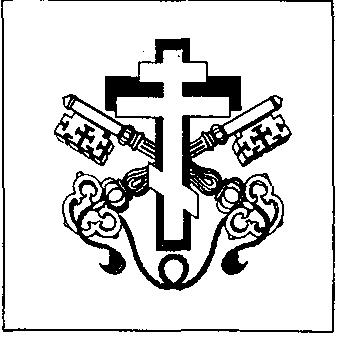

而事实上，这位“ Monseigneur ”（阁下/主教尊称）正如其简介所写，是“ Parlement mondial pour la paix et la sécurité ”（世界和平与安全议会）的主席——一个声称要确保我们的地球免遭战争与冲突的超级世界性组织。一个世界政府！你只需想一想。Busa 的世界议会出售身份证、外交护照甚至邮票。世界议会章程第10条规定：“Tous les membres accrédités auprès du Parlement mondial pour la sécurité et la paix ont droit à l'immunité diplomatique, comme le prévoient les Accords internationaux. Les mêmes avantages sont également accordés aux délégués nationaux du Parlement mondial.” 24 不管你信不信，这些假护照确实能打开大门。稍后这一点会变得清楚。当然，能进入 Busa 世界议会核心的人很少。以下比利时人被认为足以担任 Busa 创设的“政治顾问”：Emile Van Huynegem 与 Paul Cams（1983 年遭暗杀），以及 “ paltsgraaf ”（Pfalzgraaf，宫廷伯）。

De N.V. Fantastique（“Fantastique” 股份有限公司，N.V.=Naamloze Vennootschap，比荷法人之股份有限公司形式）

{style="width:2.01389in;height:2in"}

还有什么？无论如何这实在太离奇。谁会出面干预

délivrés par un autre employé belge (ex- ?) de Busa I, Pierre Pasleau. Il s'appelle lui-même'Archeveque Métropolite de Tongres'（“通赫伦宗主教大主教”）并试图通过一份四页的履历——塞满伪造头衔——来证明自己的崇高。25

