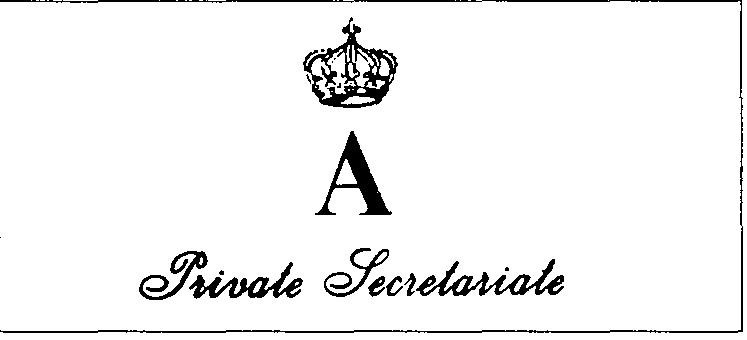

Moi, Alexis

{style="width:4.43056in;height:2.01389in"}

在骑士们幽暗的道路上，我们遇到了许多醒目的身影。国王、皇帝、王子与陵墓，寻求认可的外来者。对许多人来说，骑士精神依旧像昔日一样，是通往这种认可的路径。那些被授勋、新封的骑士们，会非常乐意去颂扬并确认自己的头衔，为他们的“大师”“皇家”或“帝国”之主、小到大地加以辩护。如此，国王、皇帝、王子与陵墓（指贵族家族的宗室）便获得了忠诚。他们于是成为“真正的”国王、皇帝、王子或陵墓之主。让那些嫉妒的人徒增遗憾。

当 Francis Dessart 成为 1986 年 1 月 30 日在比利时正式创立的“圣约翰骑士团”的“指挥官”与“特许部长”时，他因此信任了该骑士团的“皇家保护者（Protecteur royal de cet ordre）”。此人出生于 1946 年，自称是 1918 年在叶卡捷琳堡（现：斯维尔德洛夫斯克 Sverdlovsk）被杀的沙皇尼古拉二世（Tsar Nicolas II）之曾孙。这并不是第一次出现自称尼古拉二世后裔的人。更早些时候，我们遇到过一位 Michel Goliniewsky，他冒充的正是阿列克谢·尼古拉耶维奇·罗曼诺夫（Alexei Nicholaevitch Romanov），即尼古拉二世的儿子。尽管几乎所有人都认为在那阴暗的 1918 年 7 月 16 日之日，沙皇与其全部皇室家族成员已被布尔什维克处决。然而 “Golieniewsky-Alexei” 仍能在某些美国高层圈子里获得承认。这位“皇太子 Tsarrevich”也拥有一个“圣约翰勋章（Ordre de Saint Jean）”可供使用。

然后便出现了神秘的“Anastasia”。1920 年 2 月 17 日，柏林警方从 Landwehrkanal 运河里救起一名年轻女子。她说自己其实是 Anastasia Romanova，沙皇尼古拉二世最小的女儿。她是唯一逃过叶卡捷琳堡那场可怕屠杀的人。甚至直到 1960 年代，她仍向法院提出申请，要求确认这一身份并获得合法继承人认可。虽然未获成功，“Anastasia” 已多次被搬上大银幕。谜团仍在。“Anastasia” 继续激发人们的想象。

而最近又出现了一位新的候选者，一名自称是 1899 年出生的玛丽亚大公主（Grande-Duchesse Marie，尼古拉二世第三个女儿）之孙的男子。他还声称 1918 年并没有其他外人死亡——只有沙皇与其子 Alexei 被处决。其他人——那些皇室女性——得以逃脱。由于只有玛丽亚大公主曾有子嗣，而我们的“皇家赞助人（Patronne Royale）”是她的独子，这就意味着 Dessart 所认同其说法的那名男子，正是沙皇尼古拉二世的曾孙、被“加冕”并被视为俄罗斯皇室家族之首。于是此人自称：“殿下（Son Altesse Royale）Alexis 王子 d'Anjou de Bourbon-Conde - Romanov - Dolgourouky - 杜拉佐（Durazzo）与埃丁根（Edingen）公爵”。这些华丽头衔已让人感觉“Prince Alexis” 有些过度装饰，但我们暂且只讨论他对俄罗斯王冠的声称。

Prince Alexis 是一个特殊的案例。他深谙如何以帝王姿态确认自我。深色的眼睛镶嵌在一个近乎斯拉夫式的面孔上，那是一种能说服人的目光，并能巧妙地绕过陷阱的灵活神情。一个敢于在大众面前为自己主张辩护的人。1982 年，法国著名出版商 Fayard 出版了 Alexis 的书《我，Alexis，沙皇的曾孙》（Ik, Alexis, arrière-petit-fils du tsar）50。居住在巴黎的 Dolgouroukys（Alexis 使用的姓氏），甚至俄罗斯被认可的皇室家族首领——俄国的大公弗拉基米尔·罗曼诺夫（Grand-Duc Vladimir Romanov de Russie）也对其提出诉讼。这对 Alexis 几乎无伤。原告只从巴黎法官那里获得了一个权利：在尚未售出的版本中刊登一则弥撒公告。Fayard 与 Alexis 两人均被处以一笔小额罚款 51。

而 Alexis，他也获得了追随者。在某些圈子里。例如，

到目前为止，这仍然带着民间传说的味道……但是 Alexis 已能邀请到布里萨克公爵（duc de Brissac）、Pierre de Cossé，他与巴黎伯爵（comte de Paris）之子 Michel d'Orléans 公爵一起领导耶路撒冷圣拉撒路军事与医院骑士团（Ordre Militaire et Hospitalier de Saint-Lazare de Jérusalem）。

