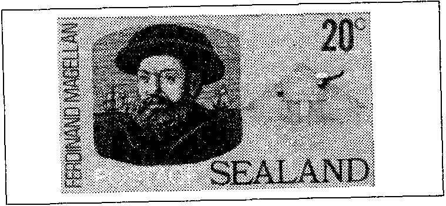

Je m'en fiche. Je m'en fiche. 注意你写的，l'Ordre 很强大！

然后门关上了。瞧，我来了，7"。

“l'Ordre 很强大，”我再次觉得。我早已知道。Bourbon-Conde 公主，Alexis 的母亲、l'Ordre 的大使，因此将不能再帮助我。我现在可以放弃了。l'Ordre 在比利时的高级显要都保持警惕。Alexis 是谁？

Edelman，乞丐

{style="width:4.5in;height:2.08333in"}

1969年9月30日星期二下午，一架装载邮件的直升机降落在布鲁塞尔国家机场。工人们卸下一个红色塑料袋时，许多人惊讶得挑起了眉毛。里面有一些贴着前所未见邮票的信件，由 Sealand（微型国家“锡兰德”）发行，并盖有 Sealandese Post（Sealand 邮政）印戳。Sealand？他们以前从未听说过。然而 Sealand 确实存在，尽管没有任何地图册提到这个国家。这怎么可能？

在英格兰东海岸、领海之外，有一座人工岛，实际上是一座金属平台，曾在第二次世界大战期间被英国皇家海军（Royal Navy）使用。战后，它被闲置。毕竟，在北海中央，一块五十米乘十二米的人工岛，你能做什么？有一个人，这个古怪的 Roy Bates（罗伊·贝茨），知道如何利用它。他从 Royal Navy 购得该岛，并于1967年9月2日宣布其为独立主权国家。他将其命名为 Sealand，并为自己加冕成为“头 77”。眼光不差。来自远方的人们来到 Sealand，与其说是为了欣赏那座金属平台，不如说是为了给自己一个全新的身份。对于这位新的“Prince Roy Bates（罗伊·贝茨王子）”，他不仅设计 Sealand 邮票或 Sealandese dollars（Sealand 美元），还签发 Sealandese passeports（Sealand 护照）。

1969年到访 Sealand 公国的绅士之一，是住在比利时的 Alex Brimeyer（亚历克斯·布里迈耶）。
