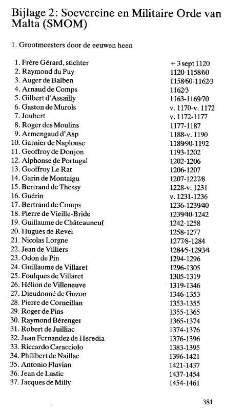
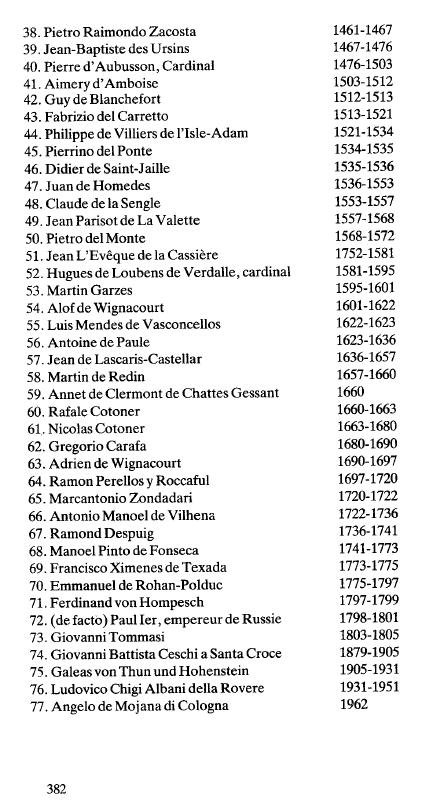

Annexe 2 : Ordre souverain et militaire de Malte(SMOM)

1.  Les grands maîtres à travers les siècles :

{style="width:2.81944in;height:4.79167in"}

{style="width:2.56944in;height:4.80556in"}

2.  Les confréries des SMOM

En 1961, la SMOM (branche du Vatican) a conclu une alliance avec des " ordres frères ". Ce sont des départements créés pendant la Réforme.

Annexe 3 : Exemples de vanité

Un exemple de curriculum vitae, en pleine vue : voir chapitre

Annexe 4 : Ordre Teutonique

Les grands maîtres à travers les siècles Jérusalem et Saint-Jean d'Acre (AKKO)

1.  Henri de Walpach v. 1190-1200

Saint-Jean d'Acre (AKKO)

2.  Otto le Kerpen 1200-1206

3.  Hermann Bart 1206-1210

4.  Hermann de Salza 1210-1239

5.  Conrad deThuringe 1239-1241

6.  Gerhard de Malberg, (dépose) 1242-1244

7.  Henri de Hohenlohe 1244-1253

8.  Popius ou Popon d'Ornesta 1253-1262

9.  Annon de Sangershausen 1262-1274

