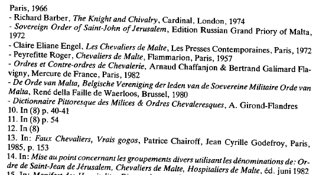

{style="width:3.16667in;height:1.75in"}

(未翻译)

15. 见：Manifeste des Hospitaliter-Ritterordens（Hospitaliter-Ritterordens 宣言），A.G. Homble，诵读于 Couvent des Grosspriorates Europa des Hospitaliter-Ritterordens（Hospitaliter-Ritterordens 欧洲大总优修道院），Ordensverlag，1973年，第20-22页。

16. Dans: Idem（同上），第20、22页。

17. Dans: 'History of the former Commandery Cut of Templars and Knights of Malta'（“前圣殿骑士与马耳他骑士旧指挥官辖区的历史”），Gilbert Jansseune（其已被授予骑士爵位），Own Erf，1970年，第70-71页（Middelkerke 旅游办公室）。

18. 该争议亦反映在《比利时公报》附件中：1- 1967年（第3449号）公布了 'Kommanderij Vlaanderen- Soevereine Orde van Sint-Jan van Jeruzalem Hospitaalridders' 的章程。

2- 1974年（第8729号）出现了 'Prieuré des Pays-Bas - Hôpital des Chevaliers de Sin-Jan Van Jerusalem' 的章程。创始人中有第1项的成员。

3- 1975年（第2366号）第1项被解散，尚余资金转移给第2项。

4- 1977年（第409号）出现了 "Caritatieve Werken van de Prefectura Flandriae der Soevereine Orde van Sint-Jan van Jeruzalem" 的章程，后改为 "Prioratus Flandriae"。成员中包括第1项的成员。

19. 该 Keure（宪章）全文：「Le Prince（亲王）是一个旨在研究荷兰民族性在个人、家庭与共同体生活中的经验与发展的秩序。秩序风格：相信荷兰文化的统一与使命。Voomaam 选择与共同体建立自觉联系。紧密的友爱，既给予又索取。忠诚与宽容，遵循奥伦治（Orange）精神。」

20. L'extrême droite et l'Etat（极右翼与国家），W. De Bock，J. Cappelle 等，OEB，Berchem-安特卫普，1981年，第104页。

21. 修订文本，Protea，佛兰德南非联络俱乐部，说明，1977年。

22. 《比利时公报》附件，第741号。

```{=html}
<!-- -->
```
23. 或据其他来源，为第44任大团长，依计数程序。

24. Histoire du gouvernement héréditaire de l'Ordre Souverain de Saint-Jean de Jérusalem, Chevaliers de Malte（“耶路撒冷至上圣约翰骑士团世袭政府史”），éd. se.，Colonel Thourot-Pichel，Maltese Cross Press Publishers，Shickshinny，1970年，第193页。

25. 主教会议随后修订其立场：1981年，主教会议将俄国皇室家族册封为布尔什维主义的殉难者。

26. Serge Dumont 在其著作 De Huurlingen（《雇佣兵》，OEB，Berchem，1983）中写道，John Birch Society（约翰·伯奇协会）实际上是三K党（Ku Klux Klan, KKK）的外衣（第165页）。KKK 亦有一个骑士称号：'Empire Invisible des Chevaliers'（“隐形骑士帝国”），其领袖为 'Sorcier Impérial'（“帝国巫师”）Bill Wilkinson。

27. 参见：L'Empire Moon（“文鲜明帝国”）Jean-François Boyer，La Découverte 出版社，巴黎，1986年，第202-203页。

In (8) p. 192（见(8) 第192页）
