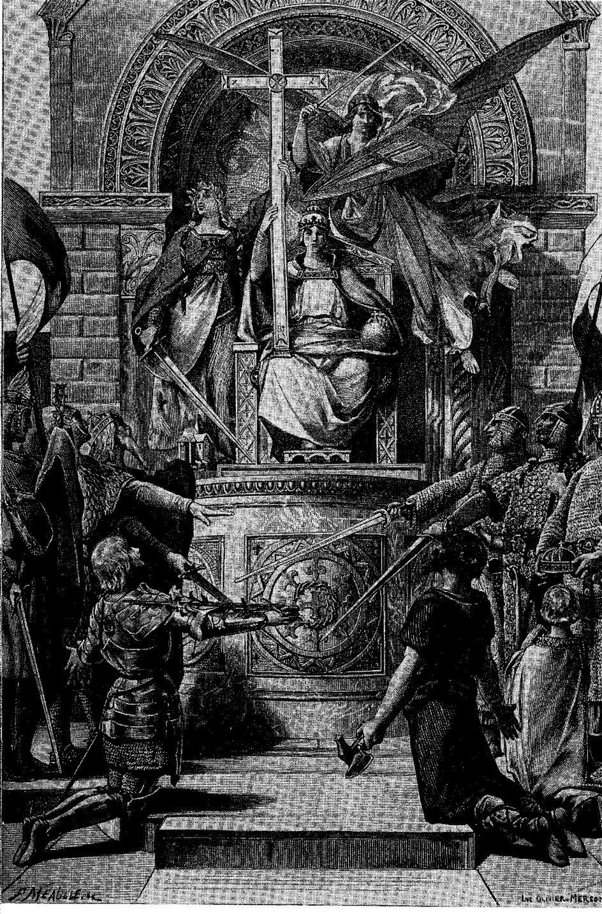
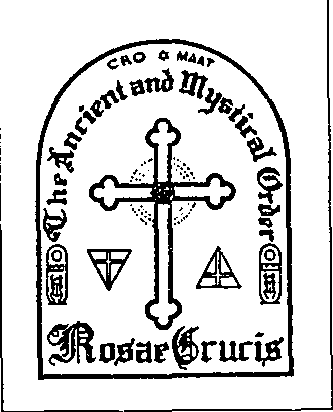

::: {#chevaliers-daujourdhui .section .level1 .unnumbered}
# Chevaliers d\'aujourd\'hui {#chevaliers-daujourdhui .unnumbered}

{style="width:5.83333in;height:8.25in"}

Chevaliers d\'aujourd\'hui : A propos des sociétés occultes et des ordres de chevaliers au XXe siècle

André Van Bosbeke

Avec mes sincères remerciements à tous les \"vipères\" et \"ex-chevaliers\" qui m\'ont aidé. Aussi les \'occultistes\' qui m\'ont fait connaître leur monde, je ne devrais pas oublier de les remercier. Enfin, il y a aussi les nombreux \" citoyens \" qui m\'ont soutenu et qui me sont chers. Je tiens particulièrement à le mentionner : Nigel Barclay, Louis Behiels, Gaetan Dejonghe, Jean-Pierre De Staercke, Serge Dumond, Julia Nyssens, Erwin Pairon, Patrick Remacle, Joel Schoups, Marleen Sleutel, Marc Vandeweerdt et Jan Willems

Dédié à Marleen, Joachim et Kevin

Couverture : Gal

Éditorial : Guido Muelenaer

Impression : Imprimerie EPO Lange Pastoorstraat 25-27 2600 Berchem

Tél: 03/239.61.61.29

Editeur OEB asbl, 1987 Lange Pastoorstraat 25-27 2600 Berchem

Tél: 03/239.68.74

\_\_\_\_\_\_\_\_\_\_\_\_\_\_\_\_\_\_\_\_\_\_\_\_\_\_\_\_\_\_\_\_\_\_\_\_\_\_\_\_\_\_\_\_\_\_\_\_\_\_\_\_\_\_\_\_\_\_\_\_\_\_\_\_\_

Note concernant la traduction

Cet ouvrage est cité comme référence par de nombreux chercheurs de vérité. Cependant il n'est référencé par aucun moteur de recherche et je m'estime donc très chanceux d'avoir pu tomber sur cette version originale en néerlandais. Une édition française a existé mais reste quant à elle totalement absente des écrans. Il ne m'en fallait pas plus pour motiver cette traduction que j'espère vous apprécierez.

Le passage de la version scannée sur le pdf au 'text' ayant servi de support à cette traduction nécessite encore quelques corrections dues à la mauvaise reproduction de certains groupes de lettres : 'in' pouvant être lu 'm' ou 'ir' devenir 'n' etc. Lorsqu'un non-sens apparaît donc au cours de votre lecture je vous invite à vous reporter à la version pdf dans un 1er temps, afin de pouvoir y comparer ce même extrait dans la version text et ainsi identifier l'erreur. Une version corrigée fera suite à celle-ci que j'ai toutefois souhaité partager en l'état pour la simple raison que le service de traduction en ligne [[https://www.deepl.com/]{.underline}](https://www.deepl.com/) ayant servi à ce 1er jet offre un résultat assez convenable déjà comparé à l'offre de Google par exemple.

J'ignore encore si le service de partage de document que j'utiliserai pour rendre justice à cet ouvrage permettra de communiquer via une rubrique 'commentaires'. Mais je vous invite vivement, si tel est le cas, à contribuer à son amélioration souhaitable en partageant vos propres corrections. Merci !

Télécharger le PDF **ou/et** TEXT

André Van Bosbeke Riddersvannu Cavaleiros de Agora (213p. (X2) https://fr.scribd.com/document/383809545/Andre-Van-Bosbeke-Riddersvannu- Cavaleiros-de-Agora

Lire la version 'text' : https://ia802806.us.archive.org/4/items/riddersvannu/riddersvannu_djvu.txt

Un 2nd lien-pdf au cas où:

Ridders van nu Over occulte genootschappen en ridderordes in de 20ste eeuw https://ia802806.us.archive.org/4/items/riddersvannu/riddersvannu.pdf

\_\_\_\_\_\_\_\_\_\_\_\_\_\_\_\_\_\_\_\_\_\_\_\_\_\_\_\_\_\_\_\_\_\_\_\_\_\_\_\_\_\_\_\_\_\_\_\_\_\_\_\_\_\_\_\_\_\_\_\_\_\_\_\_\_\_\_\_\_\_\_

Sommaire

(suivant la pagination d'origine)

Avant-propos 5

1 Chevaliers de l\'éclairage J 3

Introduction au mystère 13 Les pharaons 14

La révélation divine 16 L\'homoncule 18

Or 20

Routes de l\'A.M.O.R.C. 22 Réincarnation 25

La lumière cosmique 26

La substance divine 28

Le Livre de l\'Homme 29 Structures occultes 32

Les rites 32

Le grand secret 33

Le prêtre-roi 34

2 Les chevaliers de la nuit 39

Le Comte de Saint-Germain 39 Angela, la déesse blanche 41 Les chevaliers de la déesse blanche 43

Vitam impendere vero (sa vie) consacré à la vérité - l\'une des monnaies de l\'Ordre Renevé du TempIe). 45

Interlude I 46

Lucifer 47

Le chevalier de Lucifer : rencontre avec

Diplômes 50

Interludium II 56

Les magiciens blancs 58 Tragédies 61

Interludium III 65

La bête 666 65

Thulé ? Thulé ? 69

Angela revint sur le devant de la scène 76

L\'Ordre Vert 76

Interlude IV 80

Mithras 80 légions

Les magiciens argentins 81 Origas revisted 85

L\'Ordre Vert 76

Interlude IV 80

Mithras 80 légions

Les magiciens argentins 81 Origas revisted 85

3 Chevaliers du temple - partie I 87

Contentieux 87

Gallois 88

Le Monseigneur 89

Les Chevaliers de Monseigneur 92

Interlude I 93

Les chevaliers des Portugais comptent 94

Ils sont parmi nous 97

Nuit et décomposition 98 Larmenius 102

Interludium II 104

Des informations pour le comte ? 105

Les chevaliers du monde souterrain 109

Le massacre 113

Rêves 117

Interlude III 118

Les rêves sont mensongers 119

4 Chevaliers du temple - partie II 123

La revanche de Moctezuma 124 Pour quelques dollars de plus 125

Le Temple de Catalogne 128 Les Chevaliers d\'honneur 128 Belgique - Espagne : extensions 131

Les rêves du grand maître 133

5 Chevaliers authentiques 139

Les Chevaliers de Sainte- Lucie 139

Gravité 143

Sodon 144

La Croisade 146

La Toison d\'Or 150 L\'Empire Vie Europe 153 Royal Europe 157

6 Les Chevaliers de Saint- Jean 159

Chevalier, tenez-vous droit

La sous-élite 164 Intermède I 166

Russie-Vatican : 1-1 166

Le sort de l\'humanité 170 La révolution biologique 174 Le Tsarrevitch 179

Le quiz 183

Le cheval de Troie 186 Leyde et temps 191

Un empire mondial pour mon ordre 193

Sacerdoce et empire Belgarum 197

Animaux apocalyptiques 199

7 Routes mécaniques 201 Sottobosco 201

Ce qu\'un État peut subir 203 Interludium 204

Connexion avec le Vatican 205

L\'imitation 213

L\'ombre 213

Message du Gi-oot-Prior 214 Le deus ex machina 215 Gagnons the war and font the paix 217

La nouvelle Jérusalem 219 La boue de la terre 223

8 Des grands maîtres et des ministres 227

Jour de négociation 227 Comme avant 229

La tête 231

Le petit homme 233

Toujours vaincre, jamais vaincu 235

Interlude I 238 Obscurantisme 239 Questions, questions, questions, questions 241 Surestimation de soi ? 244 Interludium II 245 Synarchie 246

Un jour à Oosterbeek\.... 248 Nostalgie et\.... 250

\... et de science-fiction 251

Le chevalier 253

Ésotérisme 255

9 Les fils du chevalier 257 Le culte d\'adoration 257 La fontaine d\'honneur 261 Don Guijote\..... 269

Le danger rouge 271 Mouvances 274

A la gloire de Dieu 278

Ça marche, et comment ! 279 Chasse aux sorcières 281 Coexistence 284

Et les chevaliers, ils\..... 287

Saint Benoît 287

Carmina Burana 289

10 Les Teutons 291 Prussie 291

Hygiène et bien-être 292 Interludium 293

Ah Neuerbe 294 Hérétiques 296

11 La dernière histoire 299

12 Chevaliers et arnaqueurs 301

Le vœu 301

Princes, rois et empereurs 302

Vanité et mysticisme 305 Samaritains 306

Une journée à Bruxelles 308 La nouvelle haute société 309

Économie et politique 310 Décès d\'un chevalier 311 Les voyageurs du monde 313 Archers et homards 313 Souabes 317

La vie et rose 319 Interlude I 325

Le comte palatin 326 Maître de l\'univers 328

La N.V. Fantastic 331 Interludium II 332

Le mystère!ie 332

Moi, Alexis 339

La noche 345 Laissez-passer 347

Dracula va à l\'église 350 La princesse 353

Edelman, mendiant 354 Honni soit qui mal y pense 356

Blufpoker 357

Opération Bangui 359

Le témoin 364

La fin 364

Epilogue 367

Annexes 371

Notes 387

Liste des illustrations 403 Indice 405

\_\_\_\_\_\_\_\_\_\_\_\_\_\_\_\_\_\_\_\_\_\_\_\_\_\_\_\_\_\_\_\_\_\_\_\_\_\_\_\_\_\_\_\_\_\_\_\_\_\_\_\_\_\_\_\_\_\_\_\_\_\_\_\_\_\_

Avant-propos

Chevaliers\... J\'avais, par le biais d\'études précédentes, déjà été en contact avec elle de travers. Ils existent toujours. Ils tirent encore leurs épées. Quand je ferme les yeux, je me vois courir librement et sans souci dans les bois, l\'épée de bois à la main, bouclier pour la poitrine. J\'étais chevalier à l\'époque. Cette expérience revit. De plus en plus. C\'est probablement lié aux événements des dernières années. Pas un jour ne passait sans qu\'un de mes enfants ne se précipite dans ma salle d\'écriture avec une épée et un bouclier en plastique. A la recherche de prisonniers. S\'ils venaient de voir un épisode d\'Ivanhoé\' ou quelque chose comme ça, le fanatisme était encore plus fort. Même le \'Saint Graal\' de Monty Python n\'a pu tempérer leur enthousiasme. Bien au contraire. Comment pourrais-je échapper à la terreur des enfants ? L\'emprisonnement a parfois duré des heures. Fuir signifiait généralement déclencher de nouvelles hostilités, ce qui entraînait parfois des pleurs indomptables. D\'où ? Peut-être. Quoi qu\'il en soit, lorsque j\'ai commencé l\'enquête, une grande solidarité s\'est soudain manifestée. Ils ne m\'ont plus fait prisonnier. Ils m\'ont pendu aux lèvres.

Les origines de la chevalerie - comme on le suppose de plus en plus - se trouvent dans les anciennes coutumes germaniques. L\'historien romain Tacite (55-116/120) raconte comment un rite d\'initiation a fait d\'un adolescent un membre adulte d\'une communauté germanique. C\'est ainsi qu\'il est devenu un guerrier. Quand le père ceignit son fils de l\'épée, il appartenait immédiatement au rang social le plus élevé et il pouvait se consacrer au passe-temps élevé à l\'huile : la lutte.

Les premiers siècles après la chute de l\'empire romain furent incroyablement chaotiques et violents. Il s\'agissait de conquérir et de défendre des régions. Au lieu de récompenser leurs guerriers avec une partie du butin, les chefs ont divisé le territoire conquis. Le chef offrit à ses hommes une protection contre les calamités des temps troublés, tandis que l\'autre partie s\'engageait à se conformer pleinement aux souhaits militaires et autres de son seigneur. Ces contrats sont devenus la base des relations sociales médiévales ultérieures. Au lieu de la protection physique initiale, le roi ou le seigneur (le seigneur féodal) offrit à son serviteur (le vassal, le chevalier) un terrain (le prêt) pour assurer son existence et ainsi obtenir son soutien.

De cette façon, la structure a été apportée dans le temps tendant vers l\'anarchie. A la fin du VIIIe siècle, l\'ensemble de la société était imprégné de cette organisation féodale, fondée sur l\'idée fondamentale d\'un service militaire en train à prêter. Le guerrier cavalier - un cheval était à l\'époque une affaire coûteuse - lié par serment à son seigneur vassal ou féodal, n\'appartenait désormais plus seulement à la classe des combattants encore idéalisée. De plus, il est devenu gouverneur de sa région. A partir de 1100, ce nouveau statut fait du nombre toujours croissant de chevaliers le nouveau noyau de la noblesse. Les chevaliers avaient revendiqué leur place auprès de la noblesse, d\'abord issue des familles royales mérovingienne et germanique. Cela confirme que le chevalier est devenu la pierre angulaire de la structure pyramidale parfois très instable de la société féodale.

Le Xe siècle a été une période marquée par le déclin du pouvoir central, l\'anarchie, la soif de pouvoir et l\'oppression impitoyable de la population paysanne. Les chevaliers qui, à l\'époque de Charlemagne, étaient encore capables de donner corps à leur rapacité estivale sur les païens, se tournèrent maintenant vers les paysans et se battirent entre eux. Ils ont volé, pillé et invoqué leurs merveilleux droits. Le système d\'exploitation est devenu la règle et le droit au pillage a été établi. Puis les chevaliers ont également commencé à calomnier leur rapacité sur des motifs ecclésiastiques. Les membres du clergé - prêtres et évêques - ont peu à peu senti leur emprise s\'affaiblir sur une société dont l\'épine dorsale était constituée par des guerriers impitoyables.

Beaucoup d\'évêques pensaient avec nostalgie à l\'époque carolingienne, où la structure de la société était ancrée dans l\'autorité d\'un roi, un roi oint. La cruauté des combattants a aussi donné lieu plus tard à l\'hérésie, qui est apparue ici et là. Cela a donné lieu à des flambées de résistance contre les puissances établies, dont le clergé faisait également partie. Beaucoup d\'hérétiques prônaient une société sans classes et désignaient des évêques et des prêtres comme complices de l\'oppression.

Les chevaliers et les hérétiques sapaient gravement l\'autorité de l\'église. Une chose était certaine : pour protéger les intérêts de l\'église, le chevalier devait être récupéré. Le pape Grégoire VII (1073-1085) lui donnera un coup de main. Il payait pour tous les péchés à chaque guerrier, quoi qu\'il ait fait auparavant, qui défendait le patrimoine de l\'église. Mais la récupération la plus efficace a été celle des Croisades. Ils ont garanti l\'aventure, contenue dans une mission divine : la libération du Saint Sépulcre. De plus, les paysans seraient, du moins pour le moment, libérés de la bride des chevaliers.

Le pape Urbain II (1088-1099) n\'aurait pu être plus clair lorsqu\'il appela à la guerre lors d\'un concile à Clermont le 27 novembre 1095 : \"Qu\'ils partent en guerre contre les incroyants - une bataille à mener et à gagner

A Jérusalem, ils sont allés encore plus loin. Les chevaliers y avaient, sans renoncer à leurs armes, fait les vœux d\'obéissance, de pureté et de pauvreté. Ces chevaliers moines représentaient le bras vengeur de l\'église contre les malfaiteurs, les infidèles. Ils se réunissaient dans des ordres chevaleresques et étaient principalement basés dans des hôpitaux. C\'est ainsi que l\'Ordre du Temple, l\'Ordre de Saint-Jean et tant d\'autres ont vu le jour. Ces ordres ont reçu d\'importants privilèges de l\'église. Certains d\'entre eux sont devenus très puissants.

Ils ont construit cette puissance plus loin en Europe après la chute de Jérusalem.

Cette formule de réussite a été suivie. Rois, empereurs et aussi papes fondés à leur tour, pour consolider leur pouvoir et accroître leur prestige, appelés ordres de chevaliers dynastiques. Leur but sous-jacent

était de se lier la noblesse. C\'est ainsi que des ordres tels que l\'Ordre de la Toison d\'Or, l\'Ordre de Saint Michel, l\'Ordre des Haricots Longs furent créés\.... C\'étaient des ordres chevaleresques très privilégiés, accessibles uniquement aux puissants, qui avaient l\'influence nécessaire pour exercer le pouvoir central.

Entre-temps, la figure du chevalier, en tant que guerrier, en tant que combattant, était devenue beaucoup moins importante. Le service militaire n\'est plus essentiel. En fin de compte, il n\'était pas possible de mobiliser une armée décente avec le stock chevaleresque de l\'époque. Avec les impôts que le roi prélevait, d\'après l\'ancien exemple romain, on utilisait des mercenaires. Ils ont reçu une somme d\'argent au lieu d\'une terre. Cela signifierait la fin de la base féodale de la chevalerie. A partir du XIVe siècle, la véritable race chevaleresque s\'éteignit lentement. Il ne restait que les chevaliers institutionnalisés. De plus, la plupart des commandes avaient un caractère purement décoratif. La chevalerie était accordée à ceux qui s\'étaient rendus utiles à leur souverain ou à leur pays.

Au XVe siècle, alors que la chevalerie était déjà très civilisée, un renouveau de l\'idéal de chevalerie se fit jour, surtout dans les milieux de cour. Les histoires de chevaliers au sujet d\'hommes qui se sont battus pour le bien et qui ont généralement vécu des aventures très sanglantes ont été la crème de la crème. Le chevalier a reçu un code de conduite moralisateur inébranlable et ses actions ont été glorifiées. L\'exemple le plus fascinant de cette adoration presque sacrée de la chevalerie c'est les légendes d\'Arthur.

Lorsque Cervantès écrivit son Don Quichotte, il semble avoir définitivement mis fin à l\'idéalisation de la figure du chevalier. Cervantès fit honte au chevalier et l\'entraîna lucidement et irrévocablement dans le grand bain. Les conventions et les codes chevaleresques si louangés étaient, par la tentative fanatique de Don Quichotte d\'être un chevalier parfait et de répondre à l\'idéal, toujours désillusionné.

Au cours des siècles suivants, seuls quelques ordres chevaleresques continuèrent à exercer un certain pouvoir. Chevalier était de plus en plus assimilé à un titre noble, sans aucun doute. Lorsque Napoléon conquit le pouvoir, la chevalerie restante fut également éliminée. Le commandant français a aboli tous les ordres. Mais un peu plus tard, certains ordres ont de nouveau nommé leurs activités, mais avec beaucoup moins de splendeur.

\_\_\_\_\_\_\_\_\_\_\_\_\_\_\_\_\_\_\_\_\_\_\_\_\_\_\_\_\_\_\_\_\_\_\_\_\_\_\_\_\_\_\_\_\_\_\_\_\_\_\_\_\_\_\_\_\_\_\_\_\_\_\_\_\_\_\_\_\_\_\_\_\_

1.  Chevaliers de la Lumière

Introduction au mystère

{style="width:1.97222in;height:2.44444in"}

La femme blonde sirote doucement une tasse de café fumant. J\'ai un peu peur, avoue-t-elle, visiblement émotive, que va-t-il nous arriver ? Allons- nous changer complètement ? Allons-nous changer notre personnalité ? L\'autre femme, comme la blonde dans la trentaine, acquiesce. Elle aussi ressent cette peur. Toutes deux seront bientôt soumises à la \" Grande Initiation \" dans le temple de l\'A.M.O.R.C.. Alors elles seront des Rose- Croix.

Une crucifixion d\'une rose déjà initiée fait rire la tension : \" Le groupe t\'acceptera. Avoir peur de l\'initiation n\'est vraiment pas nécessaire. Il

se penche vers l\'avant, regarde les deux dames avec compréhension et dit :

