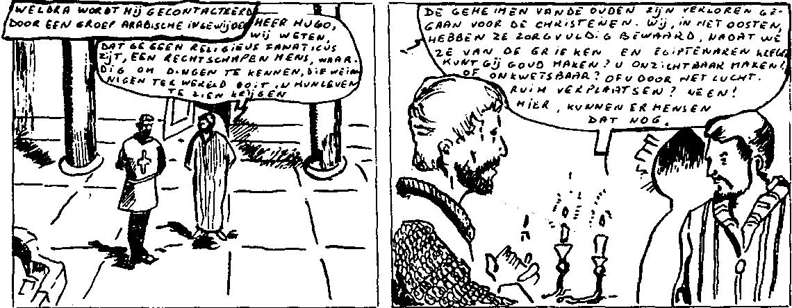
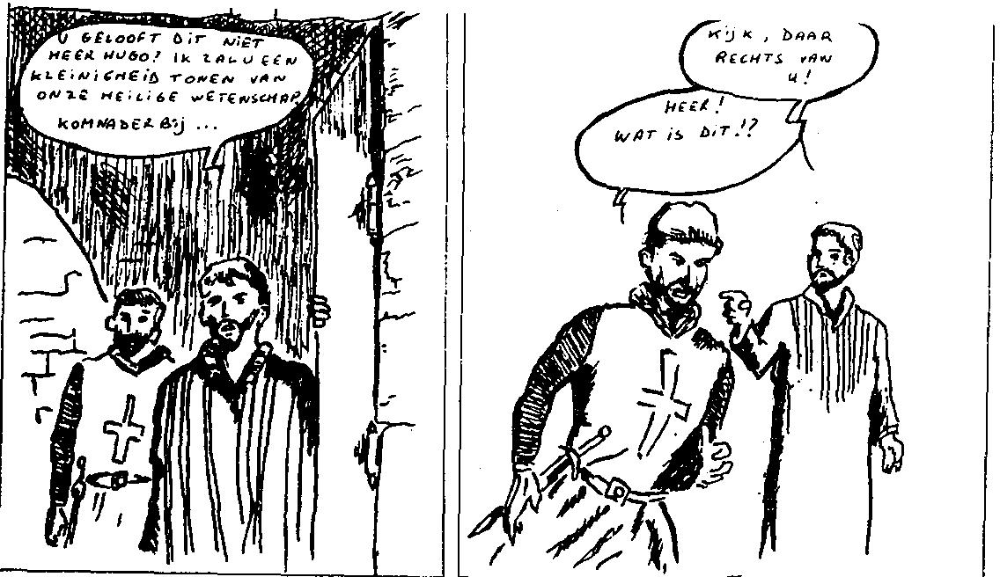
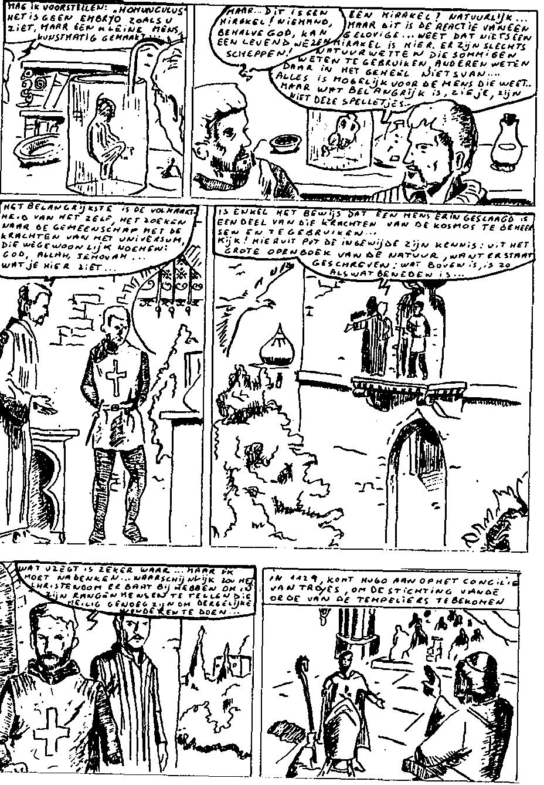

Depuis la publication des \" Fama Fraternitas \" et d\'autres manifestes rosicruciens, il y a toujours eu aussi des groupes qui se sont appelés Fraternités Rosicruciennes, se déclarant chacun comme étant les seuls vrais et suivant la vraie tradition. L\'un de ces groupes, actuellement le plus prospère, a été fondé en 1909 et est connu sous l\'abréviation A.M.O.R.C.

L\'homoncule

La vraie tradition ! A.M.O.R.C. prétend avoir le monopole de la connaissance de la vie et de la mort cachée à l\'humanité. Elle lui a été transmise par un mystérieux groupe d\'Egyptiens. Ce sont les premiers \"sages\". Ils ont fondé le centre ésotérique de la terre. Comment ces connaissances ont-elles fini par atteindre l\'Europe ? Via le mystérieux Christian Rosenkreuz ? Mais ce ne serait qu\'une figure symbolique !

Dans le passé. Plus précisément, à l\'obscurité, au Moyen-Âge sombre\.... 1099, Jérusalem. Godefroid de Bouillon conquiert la Terre Sainte : fin de la première croisade. Une victoire des chrétiens sur les musulmans ? À l\'extérieur, il semble si\.... Présenter les faits en tant que tels fausserait cependant l\'histoire. Car du côté de Godefroid de Bouillon, Hugues combattit les Payns\...\".

{style="width:5.83333in;height:2.27642in"}

{style="width:5.83333in;height:3.3629in"}

{style="width:5.5in;height:7.93056in"}

