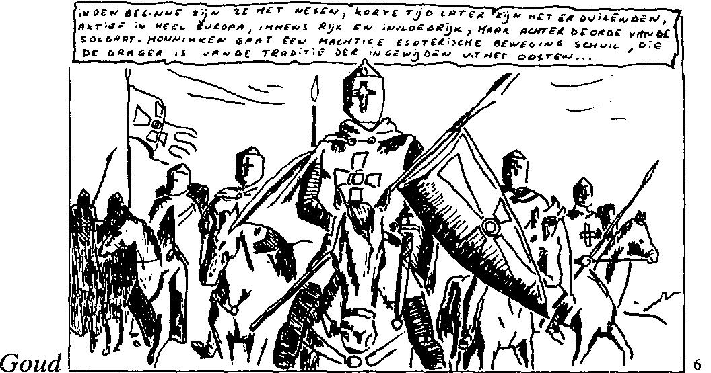

{style="width:5.83333in;height:3.06541in"}

New York, 22 juin 1916. C\'était la première fois qu\'une preuve de la réalité de l\'alchimie était fournie en Amérique, et que pour les membres eux-mêmes la manifestation avait lieu. L\'Imperateur a le droit de donner un tel test ouvert une fois dans sa vie. Celle-ci s\'est déroulée lors d\'une réunion sans la cérémonie habituelle, en présence d\'un représentant du \"New York World\". Quinze treize des trente-sept membres avaient reçu une carte de l\'Imperator, indiquant les ingrédients et objets qu\'ils devaient apporter pour l\'opération. Ils s\'engageaient à garder secrète l\'inscription de ces cartes, et à ne pas assembler les quinze parties de la formule pendant trois ans après la mort de l\'Impératrice. Après la prière et un discours de ceux-ci sur les lois de la composition de la matière, un morceau de zinc, qui avait passé l\'épreuve de l\'acide nitrique, fut placé dans une soucoupe chinoise au-dessus de la lueur d\'un creuset de creuset de fusion ; les différents ingrédients, entre lesquels aussi des pétales de rose étaient placés, furent ensuite donnés à l\'Impératrice par quinze frères et sœurs, dont l\'un d\'eux joua le rôle de Vestaalsche Maagd qui les plaça successivement sur la soucoupe. Après les seize minutes demandées, pendant lesquelles l\'opérateur a exercé une force spirituelle extraordinairement grande, le morceau de zinc a été transformé en or, qui a été déterminé chimiquement. La pièce d\'or a été exposée pendant un certain temps à la recherche du monde extérieur dans le cabinet de l\'Imperateur, et une petite pièce a été découpée, pour être envoyée au Conseil suprême des Ordres en France. 7

L\'orfèvre en question fut le premier \'Imperator\' de l'A.M.O.R.C. 8, Spencer Lewis (1883-1939). Son fils, Ralph Maxwell Lewis, né en 1912, lui succède

en 1939. Il a énormément développé l\'entreprise, à tel point que l\'Ordre compte actuellement des succursales dans une soixantaine de pays

occidentaux et environ cinq millions de membres. Le siège de l\'A.M.O.R.C., Rosicrucian Park, est situé à San José, Californie, et, conformément à la prétendue tradition de l\'Ordre, comprend toute une série de bâtiments impressionnants décorés de colonnes, de coupoles et de statues sphinx égyptiens.

