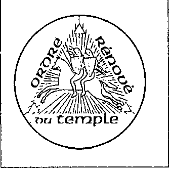

Les chevaliers de la déesse blanche

{style="width:1.97222in;height:1.97222in"}

Georges a l\'air flou devant lui. Il n\'arrête pas d\'esquiver mon regard. Cette conversation est censée évoquer de terribles souvenirs, je suppose. L\'enfer ! Ça a dû être l\'enfer. Il n\'y a pas d\'autre mot qui couvre autant de douleur psychologique et de détresse. Georges travaille maintenant comme commis de banque. Il vit seul -\'personne ne peut jamais vivre avec moi\' - et étudie la Bible pendant ses heures libres, comme s\'il voulait se repentir de sa promenade avec la déesse blanche. Quand je lui demande ce qu\'il est advenu des autres disciples, il devient cynique. A-t-il toujours

peur de l\'échec ? Certains ont heureusement fini à leur place ; ils sont dans la maison des fous ! Dehors, le soleil brûle. La rue chaude est pleine de marchands et de spectateurs errants. Les traits du visage de Georges se replient, non sans effort, en un sourire. 'Voir des visages heureux et insouciants me fait du bien', dit-il en s\'amusant.

Qui était Origas ? Revenons à la fin des années soixante. Lieu ; Rome, la crypte de l\'abbaye de San Nilo 8 . Raymond Bernard, grand maître français

de la plus grande organisation Rose-Croix A.M.O.R.C. 9, rencontre un mystérieux cardinal Blanc. Le Cardinal Blanc - représentant des Vrais Maîtres de la Terre - ordonne à Bernard de faire revivre l\'Ordre du Temple, dissous par le Pape Clément V au XIVe siècle. Ceci pour rendre l\'humanité digne de l\'ère du. Pêche pour mener l\'ère du Verseau. C\'est ainsi que l\'Ordre Renove du Temple (ORT) est né et s\'est intégré dans l\'Ancien Ordre Mystique Rosae Crucis. Bernard est devenu grand maître des deux. Quelque temps plus tard, dans la crypte de la cathédrale de Chartres, Raymond Bernard fait solennellement chevalier un certain Origas et lui donne le titre d\'huissier. Lucien Origas (1920-1981), membre de l\'A.M.O.R.C., membre du Martinistenorde de l\'A.M.O.R.C. et bien connu des milieux d\'extrême droite, reçoit encore plus d\'hommages. Bernard le couronna roi de

Jérusalem. La couronne est en zinc. Peut-être parce que le nom Origas ne semble pas assez digne d\'un roi, le tout nouveau \"Baljuw\" de l\'ORT adopte

le nom imaginatif de Humbert de Frankenbourg.

