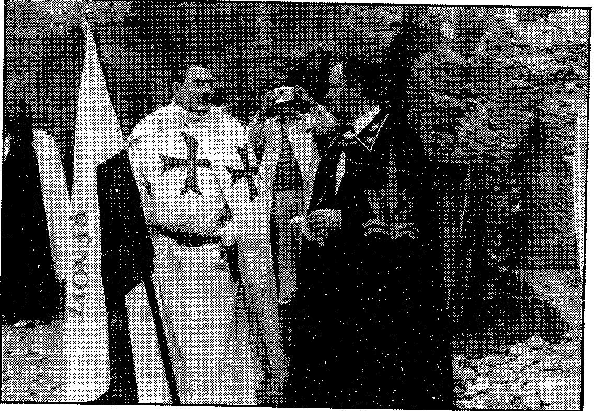

{style="width:5.83333in;height:4.04841in"}

Georges m\'a dit : \" En 1975, Origas s\'est rendu plusieurs fois à Bruxelles. Il a dit que 1975 serait le début d\'une nouvelle ère. Il a parlé d\'une nouvelle super race. Le Grand Maître de l\'Ordre Vert en a jeté les bases. Un ami personnel et un grand homme, dit-il.

La Société Thuléenne et l\'Ordre Vert\.... Que représentent ces organisations

Lucifer

En 1975, le doigt infaillible du pape Paul VI a une fois de plus fait signe

XIIe, XIIIe et XIVe siècles sont déjà loin derrière nous. Mais combien de têtes ces êtres surnaturels et malveillants, qui écoutent des noms maudits comme Satan, Lucifer, Bélial, Béelzébuth, etc. n\'ont-ils pas été mis en

foin ? Inconnu ! En outre, les prêtres et les moines se sont battus avec

les princes des ténèbres pour conduire les gens à la\'Lumière\'.

