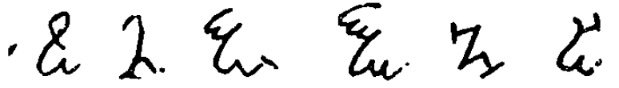

L\'église nous a appris à supprimer nos instincts : le sexe est mauvais. Mais, comment pouvez-vous atteindre un nouvel être humain si vous ne vous connaissez pas vous-même, si vous ne savez même pas qui vous êtes vraiment

dans la Bible. L\'antéchrist effacera le Christ, qui n\'est qu\'une illusion créée par des gens égoïstes. Pas sans lutte. Et nous sommes très près de\...\".

Les missiles nucléaires\", je demande avec hésitation. Et le terrorisme\", acquiesce le chevalier de Lucifer. Êtes-vous un terroriste ?

Je terrorise à distance. Toutes les forces qui contrôlent la contamination romaine sont en elles-mêmes positives.

La Mercedes tourne habilement sur une rue étroite. Un peu plus loin, en face d\'une maison de ville grisâtre, nous nous arrêtons. Je sors de là. Personne à voir. Dans la course de voitures de distance sur les autoroutes. Il est huit heures.

Elymas ouvre la lourde porte et me conduit au sous-sol, le temple des chevaliers de Lucifer. A l\'avant, dans le petit espace noir, se trouve une table carrée en bois. Il est surmonté d\'un calice, marqué de runes. A gauche, une dague avec les mêmes runes. A côté se trouve un porte-encens. A droite du calice se trouve un magnifique chandelier ancien, contenant trois bougies. Tous les objets semblent porter les mêmes caractères runiques :

{style="width:4.58333in;height:0.65278in"}

ou Elymas. Cela signifie que les objets rituels sont affligés de mes pouvoirs magiques, dit Elymas, ils sont totalement dignes de confiance. Ils font ce que je veux qu\'ils fassent.

Le chevalier de Lucifer me demande de m\'asseoir à la porte qui s\'ouvre sur le temple : \" Ne mettez pas de maïs dans la chambre \", prévient-il, \" Je ne peux garantir les conséquences si vous entrez dans le temple pendant la cérémonie.

Elymas quitte le temple, \"pour se préparer\". Je suis assis à côté, protégé selon Elymas. Étrange, je crois, je me sens plutôt bien. Pas de peur du tout. Tout cela semble plutôt risible : tout comme la tente exorciste de la foire de Bruxelles.

Sur le revêtement de sol du petit temple sombre, éclairé seulement par une lampe pâle de 25 watts, trois cercles concentriques sont dessinés \" pour éloigner les esprits ennemis \". Dans le cercle intérieur, qui doit avoir un diamètre d\'environ deux mètres, un pentagone a été dessiné. Dans les cinq triangles du Pentagone, il y a de majestueux personnages runiques.

