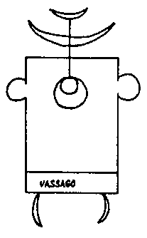

La partie centrale est également pleine de gribouillis particuliers. J\'y reconnais clairement les runes d\'Elymas. Les autres personnages représenteront les noms des compagnons d\'Elymas, je suppose.

Soudain, une musique cosmique douce se fait entendre. Cependant, je n\'avais remarqué aucun orateur dans le temple. Ils sont bien camouflés dans les coins sombres de la pièce. Elymas entre en scène, habillé entièrement en noir. Une ceinture rouge autour de la taille rompt la monotonie. Au niveau de la poitrine, je remarque, également en rouge, les mêmes runes omniprésentes : Elymas.

L\'apparition noire se déroule dans la partie centrale du pentagone et crie d\'une voix lourde : \"Empereur Lucifer, maître des esprits rebelles, je te demande d\'être gentil avec moi, maintenant que je vais appeler tes minis à Vassago. Ô prince Béelzébul, ô Astaroth ! Grand Comte, : sois aussi disposé favorablement envers moi. Quand les mots magiques ont germé, Elymas a raison. Il prend une sorte d\'amulette sur la table, se penche sur moi et la suspend autour de mon cou, \" pour se protéger \". Maintenant, les vrais préparatifs sont faits. Tous les objets sont méticuleusement retirés de la table, qui est soigneusement placée dans la partie centrale du pentagone. Sur la table, Elymas dessine un triangle à la craie blanche. Il y place une pierre naturelle provenant d\'un coffre dans un coin du temple. A droite du triangle, le chandelier est placé solennellement. Les bougies sont allumées. Sur le côté gauche du triangle se trouve maintenant le porte- encens qui se vaporise. Des murs orientaux profonds envahissent peu à peu la pièce. Le poignard et les autres objets sont soigneusement placés à côté de la table. Elymas se lève pour éteindre la lumière électrique et éteindre la musique. Le temple a quelque chose de sinistre : des ombres bizarres dansent contre les murs. Seulement maintenant je remarque que les cercles concentriques, ainsi que le pentagone avec les runes dessinées ont des propriétés fluorescentes. C\'est un visage étrange, surnaturel. \|

C\'est le calme de la souris. La forme noire est placée derrière la table. Il dit doucement : \" Que ma volonté soit faite. Dans un tiroir de la petite table, Elymas sort un papier blanc et un stylo plume. Il dessine lentement, de sa main ferme, la \" règle de Vassago \" :

{style="width:1.22222in;height:1.97222in"}

