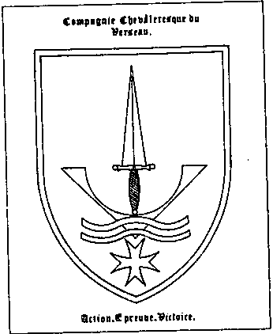

Les magiciens blancs

{style="width:2.04167in;height:2.5in"}

Le Verseau est né d\'un sentiment de rejet, d\'une part pour la chevalerie de salon et d\'autre part pour les bagarres nocturnes. Par désir de trouver en ce monde des mendiants qui se battent dans les douves, l\'épée à la main et aux côtés de leurs Seigneurs. Notre Ouest commence à ressembler à un fossé. J\'étais vêtue de haillons, une épée à la main, et j\'ai rencontré un \"Raoul Alibert\" et un \"Saumier d\'Albi\". Ils n\'étaient pas mieux habillés que moi, et entre deux coups d\'épée et des talons d\'épée, on parlait de Cervantes. Ah, mes frères, comme la dentelle et les boucliers richement décorés se balançaient ; et comme nous grimpions hors des douves après la bataille, la mousse verte complétait notre tâche. 22

Summer ! Et vous le remarquez. L\'autoroute de Charleroi est submergée par un soleil d\'été précoce mais chaud. Si je roule trop vite, vous devriez le dire \", prévient mon partenaire, qui m\'avait auparavant proposé de me présenter la Compagnie Chevaleresque Universelle du Verseau. Vous verrez, ce sont des gens francs et honnêtes.

Dans la maison de Claude Vanderus, une surprise m\'attend : le\'Vénérable Maître Maître\' de la Compagnie, Michel Vanderus, et un autre dignitaire, Mgr Colin, sont également présents. Leurs dames sont là aussi. J\'ai été chaleureusement accueilli:\'Un verre de vin\'.

Au début, nous sommes un \" compagnon \", une confrérie, avec une inclinaison chevaleresque. Notre filiation chevaleresque provient du baron du Geniebre via Alibert de la Vallee\'.

Fondé en 1977 23, le Verseau - nom qui fait référence à l\'époque astrologique - compte une trentaine de membres, frères chevaliers, répartis entre la Belgique et la France.

Et ce n\'est pas rien, si vous savez que nous avons eu des difficultés en 1980, ce qui signifie que les trois quarts des membres de l\'époque ont démissionné. Et, surtout, si vous réalisez que le \"Verseau\" est une école d\'apprentissage qui n\'est pas pour tout le monde. Le Vénérable Maître

Maître fait une pause.

