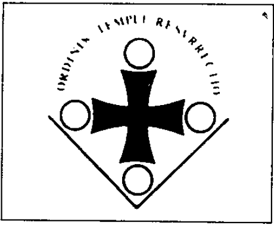

\_\_\_\_\_\_\_\_\_\_\_\_\_\_\_\_\_\_\_\_\_\_\_\_\_\_\_\_\_\_\_\_\_\_\_\_\_\_\_\_\_\_\_\_\_\_\_\_\_\_\_\_\_\_\_\_\_\_\_\_\_\_\_\_\_\_\_\_\_\_\_\_\_

4.  Chevaliers du temple - partie II

'Rien n\'est perdu, tout peut être sauvé'. Ces paroles ailées sont la devise de l\'Ordre des Chevaliers du Saint-Tempie : 'Dans un monde de vice, où les valeurs sont renversées et les principes moraux oubliés, la prière sera la nourriture essentielle des Templiers.'1.

Le grand maître Michel Carpenet, évêque galicien, est assisté dans sa croisade par le \" lieutenant-général \" de l\'Ordre, le \" Comte de Vallesonora \". En réalité, ce \'comte' le Belge Roger Niset. Le titre noble, choisi d\'après la maison de disques Vallesonora de Niset, il l\'achète au prince Moctezuma, prétendant à la couronne de la\... Aztèques.

{style="width:2.72222in;height:2.23611in"}

