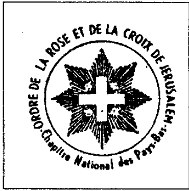

Une délégation du Centre National d\'Entrainement Commando était également présente. Après avoir regardé les diapositives, l\'entreprise a également pu s\'exercer sur le terrain\.... 30. Il apparaît aujourd\'hui que cette unité de commandement est une organisation officielle, dépendant du ministère français de la Défense. Et puis j\'ai remarqué ce qui suit : les vice- présidents sont le délégué pour l\'Espagne de l\'Association Belgo-Hispanique et le CECIF est un certain Eugenio Jose Mendez de Haro, Marquis de Haro- Union. Ce monsieur était également présent au célèbre banquet du 25 novembre 1978 aux côtés du Lebon et du Prince Charles. Le Marquis est dignitaire ou grand maître de dizaines d\'ordres de chevaliers méconnus, tels que l\'Ordre de Saint-Lazare, l\'Ordre de la Merci, l\'Ordre du Temple de Jérusalem, la filiale catalane, l\'Ordre de la Légion d\'Honneur de lmmaculéee et la Légion d\'Antioche de Saint-Georges, etc. Au moins jusqu\'en 1975, il était aussi le chef de la maison civile de Son Altesse Royale et Impériale le Prince Guillermo III Grau-Moctezuma. Le\'marquis\' s\'est avéré être un faux marquis. Jusqu\'à présent, ça a l\'air drôle, peut-être ridicule. Mais notre marquis n\'a pas pu résister à la forge. Le 12 mars 1975, Eugenio José Mendez de Haro est arrêté par la police espagnole à Barcelone. Il s\'est avéré être le chef d\'un gang qui était occupé avec la contrefaçon de billets de mille pesetas 31 ! Relations étranges\...\.... Et le représentant néerlandais du CECIF au Liban, Harry van Uden van Ophoven ? Un autre prince, une autre histoire\....

Les rêves du Grand Maître

{style="width:2.19444in;height:2.20833in"}

Le Grand Maître est assis devant le drapeau de l\'Ordre, à côté d\'une table sur laquelle reposent la Bible, l\'Epée au fourreau, les décorations de l\'Ordre et les témoignages chevaleresques.

Le Grand Maître : \" Que demandez-vous ?

