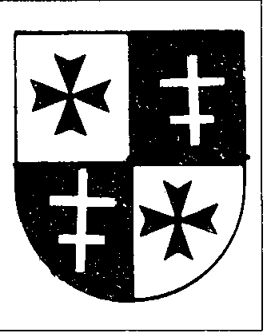

Sodome

{style="width:1.97222in;height:2.47222in"}

Les \" rêves \" du \" grand maître \" Harry van Uden van Ophoven sont encore frais dans ma mémoire. Ils me semblent plutôt des cauchemars\.... Le\'grand maître\' peut-il compter sur l\'imitation ? je me demandais avec inquiétude. D\'une part, il y avait Sylvere Lebon, qui semble être un lien dans un circuit international de droite à extrême droite. D\'autre part, il y a le\'Deutsche Tempelherren Orden\', le\'Ordo Militiae Cruris Templi\' (OMTC), dirigé par Horst Frischmuth, l\'ami de Harry. L\'exemple de Frischmuth est l\'ex-Abwehr Fred Sheuermann, le contact de l\'agent Charly Lascorz et Daniel Zdrojewski à l\'époque du scandale des\'Templiers du SAC\'. Les \" Deutsche Tempelherren \" se trouvent à proximité immédiate du poids lourd politique bavarois Franz-Joseph Strauss, l\'homme de l\'ordre qui se dirige vers une nouvelle ère glaciaire entre l\'Est et l\'Ouest. Car en Orient, il y a le matérialisme, la dégradation des valeurs morales. L\'Ouest est déjà très contaminé. Pensez à Sodome\...\...

Le soleil est déjà bas pendant que je lis un article. Un article très étrange, écrit par un homme remarquable, publié dans un magazine mystérieux. Entre autres choses, on chante les louanges de l\'OMTC. Je lis et relis. Est-ce que tout tourne par ici ? L\'article en question a été

rédigé par l\'archiduc Otto von Habsburg et est publié dans le bulletin de l\'Association Belgo-Hispanique 13. Après avoir plaidé chaleureusement en faveur d\'anciens idéaux de chevalerie tels que le courage, l\'honneur, l\'abnégation, l\'abnégation, le Habsburger supérieur poursuit : \" Actuellement, la plupart des vertus chevaleresques sont devenues rares. La foi s\'efface, et avec elle aussi le service désintéressé en l\'honneur de Dieu ; le courage disparaît aussi dans le conformisme général. L\'honneur personnel disparaît à l\'arrière-plan au profit de ce qu\'on appelle l\'idéal du niveau de vie. Il reste peu de gens qui résistent à l\'appel du matériel pour poursuivre ou défendre des valeurs spirituelles.

