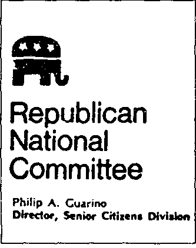

Après l\'assassinat de l\'inspecteur Massie et de sa famille, le journaliste français Paul Tesseire a publié une histoire assez improbable. Un témoin a affirmé que les meurtres devaient être liés à des transactions secrètes d\'armes impliquant la CAS, P2 et les Templiers 30 . A peine un jour après la publication de cet article, un certain Alfred Zappelli, qui prétendait parler au nom des \" Templiers \", a nié avoir quoi que ce soit à voir avec cette affaire. On n\'a pas découvert pour quel ordre templier Zappelli parlait. Alfred Zappelli est à la tête de l\'Ordre Souverain et Militaire du Temple de Jérusalem, dans lequel Guarino a été fait chevalier\...

L\'initiation

Frère, aujourd\'hui tu es mort : pour toi, la vanité de ce monde a disparu. Votre mort vous permet maintenant d\'ouvrir les portes de la connaissance. Vous venez de participer au miracle originel. Vous faites partie du mythe du début. Vous êtes ressuscités après l\'immersion dans la source du sacré, vous êtes pour toujours dans la lumière. Maintenant, l\'épée des chevaliers descend. Fils de l\'immortel, tu es immortel ! Un chevalier du temple est né.

L\'ombre

{style="width:1.97222in;height:2.5in"}

Restons un peu en Italie. Licio Gelli, chef de la P2, a consacré toute sa vie - il l\'a déclaré lui-même - à la lutte anticommuniste. L\'Italie, pensait Gelli, était en grand danger. Partout, les odieux communistes pénétrèrent dans les régions les plus élevées de l\'appareil d\'Etat. Gelli n\'était clairement pas seul. Il pourrait faire appel à des alliés puissants dans les milieux politiques, militaires et économiques. Il a eu des contacts avec des personnalités des services d\'information italiens et étrangers.

