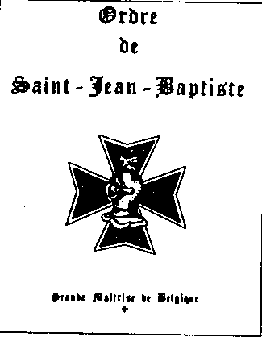

\_\_\_\_\_\_\_\_\_\_\_\_\_\_\_\_\_\_\_\_\_\_\_\_\_\_\_\_\_\_\_\_\_\_\_\_\_\_\_\_\_\_\_\_\_\_\_\_\_\_\_\_\_\_\_\_\_\_\_\_\_\_\_\_\_\_\_\_\_\_\_\_\_

8.  De la part des grands maîtres et des Ministers

Le jour des bonnes affaires

{style="width:1.91667in;height:2.47222in"}

Malgré la bruine persistante et le vent mordant, la rue Neuve à Bruxelles voit le noir des gens. C\'est l\'heure des négociations. Peu de commerçants ont l\'œil pour la combinaison plutôt étrange de la renaissance classique et du baroque flamand sur la façade du Finisterrae. Les visages sont tournés dans la direction opposée, où les articles à prix fortement réduits dans des vitrines lumineuses attirent l\'attention. Quelques-uns quittent précipitamment la masse errante et entrent résolument dans l\'église. Imperméable ou manteau foncé sur le bras, le costume ou l\'attaché-case dans leurs mains, les dames et messieurs se dirigent solennellement vers les premières rangées de chaises du Finisterrae. Madame van H., \" Grande Visiteuse \" accueille chaleureusement les \" Gentes Dames \" et \" Messires Chevaliers \" de l\'Ordre de Saint-Jean-Baptiste, Milice Templiere des Hos pitaliers.

