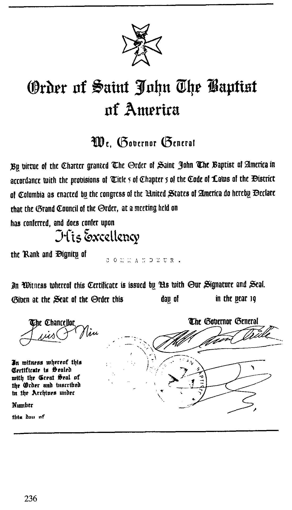

{style="width:5.56944in;height:9.68056in"}

On rejoint la Chevalerie comme certains adhèrent à une religion ; on ne vient pas chercher des médailles. Tournez-vous vers vous-même et réfléchissez à votre nouvelle situation. Le temps est venu pour vous de réfléchir sur les devoirs associés à la dignité qui vous sera bientôt accordée, car c\'est là que commence la mission qui est confiée à chaque Chevalier de notre Ordre.

Tu tourneras ton manteau avec dignité, entouré de tes frères. Vous serez courtois envers tous, et en particulier envers l\'Ordre et ses Chevaliers. Il n\'est pas possible que vous puissiez interpréter votre vie de Chevalier de différentes manières, il n\'y en a qu\'une seule. C\'est le don de soi sans erreur, une présence constante de l\'Esprit, un sens attentif du devoir, une efficacité généreuse. Il n\'est pas possible de se donner en restant passif

Le décorum dont vous êtes entouré n\'est qu\'une confirmation symbolique, une représentation ésotérique de ce qui se trouve dans l\'âme d\'un Chevalier ; seuls les yeux et les oreilles de l\'initié peuvent le saisir. Vous devrez vous battre et faire preuve d\'une bravoure banale et banale, mais qui demande souvent plus d\'efforts qu\'une action ponctuelle et aveuglante. Un chevalier ne regarde plus la vie avec les mêmes yeux que le profane. J\'espère pour vous, comme pour nous étrangers, que la Chevalerie signifie plus qu\'un rituel solennel sur Saint Martin, les vêpres sur Saint Georges, et une croix sur votre poitrine.

La chevalerie de nos ancêtres, des croisades à l\'Extrême-Orient en Terre Sainte, a trouvé son caractère noble dans la lutte contre l\'hérésie. De nos jours, l\'hérésie a été dépassée depuis l\'époque des Croisades, les chevaliers modernes ont d\'autres hérésies à surmonter. L\'épée que nous portons est un symbole, un symbole vivant dans la lutte contre l\'injustice dans notre monde moderne. Nous tirons cette épée contre l\'oppression morale et physique, contre la pauvreté. Nous ne vivons plus dans les siècles des croisades en Terre Sainte, mais à l\'époque de la chevalerie morale. Sa mission est de sauver des personnes surchargées de souffrance physique et morale, de désespoir et de doute, et ce par charité. La chevalerie de l\'altruisme doit résister aux égoïsmes matérialistes et soutenir de toutes ses forces les faibles, les malades et les opprimés.

