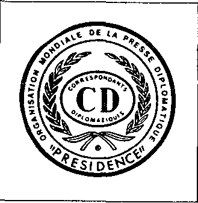
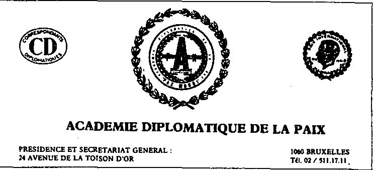

Le voyageur du monde

{style="width:1.94444in;height:2in"}

Rappelez-moi dans quatorze jours \", dit Dirix, actuel président du Pax Mundi, \" Je reviens d\'Espagne et je pars pour Moscou dans quelques jours \". Voyageur du monde\' Urbain Dirix est prêt à me parler. Quatorze jours plus tard, je compose à nouveau le numéro du président. Il se souvient de notre conversation. Oui, je n\'ai pas beaucoup de temps maintenant, mais vous viendrez au château d\'Ordingen samedi. Il y a une telle rencontre des \"Chevaliers de la Paix\". Là-bas, nous pourrons probablement parler un moment.

Les Chevaliers de la Paix ?

\"C\'est la chevalerie de Pax Mundi. Je vous vois aux ordres. Il est temps de sortir mon plus beau costume du placard. Archers et homards

{style="width:4.40278in;height:2in"}

Sur le parking du château d\'Ordingen, une banlieue de Brustem près de Saint-Trond, sur le côté du château du 19ème siècle, vous trouverez BMW, Volvo, Mercedes. Certains d\'entre eux portent l\'insigne CD. Dans de la compagnie Teressant, je suppose. Le château, construit sur une forteresse joyeuse de l\'ordre Teutonique, est magnifiquement situé à côté. Le tout, propriété de la famille Beckers - \" particulier, riche en pierres \", mais des gens sympathiques, vous savez,\' dit un homme à qui j\'ai demandé le chemin - est très bien entretenu.

Dans un salon du château m\'attend une réception debout. Les deux sur les armoires anciennes comme sur la spacieuse cheminée prijken Teutoonse casques, rappelant le grand passé de cet endroit.

