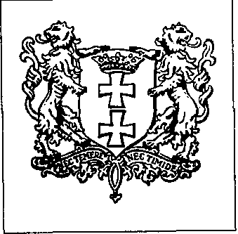

Il va sans dire que toutes ces distinctions ne sont rien du tout, et qu\'elles proviennent du cerveau imaginatif des individus. Ou, comme l\'a dit le professeur Jonathan Riley-Smith de l\'Université de Londres, spécialiste des ordres de chevaliers médiévaux, prose\'isch : \" Quand on regarde de près ces ordres fantastiques, on découvre que beaucoup de leurs membres vivent dans un monde fantastique. 19 Et si le monde imaginaire devenait une dure réalité ?

Lorsque Vella-Haber du Marquis a égayé le banquet New Carlton de Paul Cams le 1er décembre 1979, Paltsgraaf van Huynegem était également membre de Pax Mundi. En retour, Cams et Dirix ont été autorisés à exercer des fonctions vénérables dans la création du paltsgraaf, l\'Institut des Relations Diplomatiques (IRD). Cams est même devenu \" président du comité d\'honneur européen \" de l\'IRD. L\'invité d\'honneur de la soirée, le marquis Vella- Haber, était le \" président national \" des relations maltaises. Un autre bien connu, Son Altesse\' Caspis von Schwaben a établi des contacts en Italie. En bref, Van Huynegem s\'est assuré un réseau mondial de relations par l\'intermédiaire des \" évêques \", des \" tombes \", des \" princes \", des \" rois \" et des empereurs (en exil, bien sûr). En Belgique, il a intensifié ses contacts avec l\'Association Belgo-Hispanique de Sylvere Lebon, qui l\'a inscrit à l\'Ordre du mérite Belgo-Hispanique. Lebon est entre autres le représentant belge de l\'empereur aztèque Moctezuma, pour qui Van Huynegem n\'a pas caché son admiration 20.

Malgré le réseau douteux, quoique majestueux, du \"Paltsgraaf\", il réussit parfois à pénétrer dans les cercles - réels - supérieurs. Dans son Annuaire de l\'IRD de 1979, une photo remarquable est imprimée. Il montre comment feu le Prince Charles de Belgique se voit décerner le diplôme de \" membre honoraire \" de l\'IRD par Van Huynegem. Une photo à déballer, bien sûr. Mais ce n\'est pas lui. Les membres du Comité d\'Honneur\' sont selon la même édition : l\'ancien président américain Jimmy Carter et l\'actuel Premier ministre français Jacques Chirac. Le paltsgrave voudrait appartenir à ces cercles élevés et c\'est à cela que sert l\'IRD, fondé en 1974.

Faire office de médiateur entre les ambassades, les consulats et les organisations internationales et nationales, facilitant ainsi les contacts entre elles et les pays et régions où elles sont représentées\", tel est le libellé des statuts 21. Un noble objectif. L\'Ordre du Mérite Diplomatique a été créé en même temps pour assurer le bon fonctionnement de l\'entreprise. Qui ne se donnerait pas la peine d\'obtenir le titre suivant : \" chevalier, officié, commandant, grand officier, grand-croix ? Une adresse : Leemansplaats 3, à Ixelles. Cela ne vous coûtera pas beaucoup d\'efforts si vous travaillez dans une ambassade ou une autre.

Juste un peu d\'argent. Un homme qui avait l\'habitude d\'aller avec le paltsgrave m\'a dit : \" Van Huynegem m\'a murmuré un jour pendant un de ses banquets : \" Il y a 365 jours par an et il y a presque 365 pays, donc presque une fête nationale par jour. Il s\'agit donc de trouver un système pour vous inviter tous les jours de l\'année, puis de distribuer des médailles\'V Certaines de ces médailles coûtent 20 000 francs.

Maître de l\'univers

{style="width:2in;height:1.97222in"}

L\'une des relations les plus merveilleuses de Van Huynegem est sans aucun doute son correspondant sicilien,\'Monseigneur\' Victor Ivan Busa I. Le\'Monseigneur\' est une figure clé dans ce monde remarquable. Cela s\'avérera être le cas. J\'invite le lecteur à rester calme et à lire la déclaration suivante - vous n\'avez pas à vous lever :

PATRIARCAT DE DANTZIG ET DES ÉGLISES APOSTOLIQUES CATHOLIQUES OCCIDENTALES ET ORIENTALES DE LA DIASPORA.

Église primitive catholique apostolique primitive d\'Antioche Nous

VIKTOR IVAN I BUSA

par la grâce de Dieu

Archevêque métropolitain de Bielastock et de la Sainte Eglise orthodoxe, Patriarche de Dantzig et des Eglises catholique apostolique occidentale et orientale de la diaspora. Patriarche mondial des Patriarcats orthodoxes d\'Amérique, Patriarche œcuménique de la Ville Sainte, Patriarche des Russes biélorusses de Pologne, Prince du Saint Empire romain byzantin, Prince de Samarkande, Prince de Palikastro, Prince souabe de Lax, Duc de Bourgogne, Duc de San Ibiza, Duc de San Ibiza, Duc de Potar, Duc de San Andrea, Marquis de Tozhok, Marquis de Dragonera, Comte d\'Allonsk, Baron de Kiev, Seigneur de tous les pays russes et de l\'Orient mongol et tartarese.

