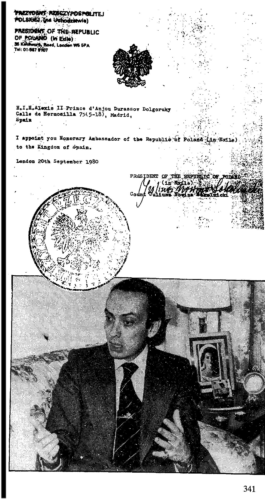

{style="width:5.15278in;height:9.68056in"}Je vous nomme Ambassadeur honoraire de la Republique de Pologne (en exile) au Royaume d\'Espagne.

En 1976, De Cosse donna à Alexis - en sa qualité d\'arrière-petit-fils du tsar - le titre gracieux de Chevalier grand-croix d\'Honneur et Justice et promit de créer un \" Prieuré d\'Ukraine Ruthenie \" de l\'Ordre 53. L\'Ordre du Cosse avait déjà eu le grand honneur de recevoir l\'archiduc Otto des Habsbourg. Folklore ? Fantaisie ?

Alexis a des ennemis que j\'ai déjà signalés. L\'un d\'eux est le Prince Nikita Dolgourouky. Il ne dit pas qu\'il est tombé si bas à cause de l\'abus de son nom. Nikita Dolgourouky est surtout troublé par le fait qu\'Alexis sait comment convaincre les Ukrainiens en Allemagne, en France et en Amérique. Les exilés \" attendent une bonne occasion de le couronner roi \", selon Nikita 5 . Et là, ça devient sérieux. L\'influence des exilés ukrainiens s\'est fait sentir, comme le dit Alexis lui-même 55, via le \" Bloc des nations anti-bolchevique \", ABN. Alexis est resté presque toute l\'année 1973 au siège social d\'ABN à Miinchen. Les contacts exacts qu\'il a alors établis restent obscurs. Mais il est presque certain que ces contacts se situaient dans des cercles d\'extrême droite, fascistes ou nazis, tout cela sous le couvert de l\'anticommunisme. ABN a grandi à partir d\'anciens combattants de l\'armée dite Vlasov. Le général soviétique Andrey Vlasov, qui faisait partie de l\'Armée rouge, fut capturé par les troupes allemandes pendant la Seconde Guerre mondiale en 1942. Il rejoint ensuite les Allemands et devient le chef d\'un mouvement patriotique et antisoviétique de prisonniers de guerre russes. Vlasov a formé des unités de volontaires pour le front de l\'Est et a fondé le \" Comité pour la libération de la Russie \". Après la guerre, Vlasov fut condamné et exécuté par les Soviétiques. Beaucoup de ses partisans ont fui vers l\'ouest 56 .

Le journaliste français Frédéric Laurent mentionne également ABN dans son ouvrage de référence\'L\'Orchestre Noir\'. Laurent explique certaines choses. En 1972, un congrès international de néo-fascistes a été organisé à Miinchen. L\'exilé ukrainien Yaroslav Stetzko, chef de l\'ABN, était également présent à ce congrès. L\'un des participants a déclaré : \" Officiellement, nous n\'avons pas parlé de terrorisme pendant la conférence. Mais la nuit dans les pubs, les discussions portaient bien sûr sur les relations opérationnelles entre les groupes et les possibilités d\'action. Un rapport de la police italienne en charge de la lutte antiterroriste indiquait alors que \" l\'un des objectifs de la conférence de Miinchen était l\'organisation d\'attentats en Italie \" ! Laurent écrit : \" Parmi les participants à la réunion, il y avait un personnage étrange. Les informateurs de la police italienne ont indiqué qu\'il était étroitement lié à cette opération.

