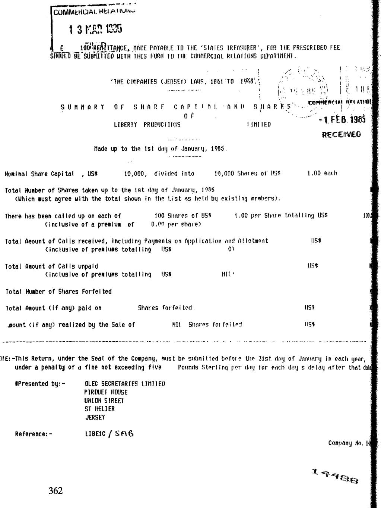
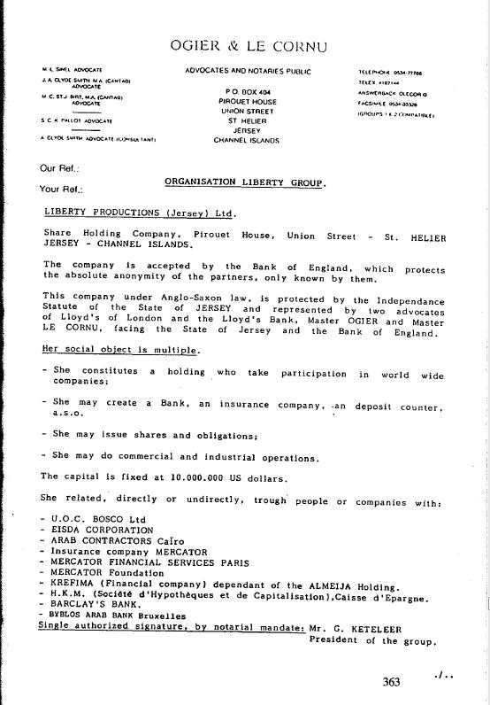

Un homme d\'affaires anversois voulait parler, dans l\'anonymat le plus complet. Cet homme dit qu\'il se sent mal quand on lui en parle. Il avait l\'air extrêmement nerveux, anxieux. Vous êtes soit du BOB, soit du BBI ou de la Sûreté de l\'Etat\", a-t-il dit. Bien que je l\'aie nié, il n\'y avait pas le moindre doute pour lui.

{style="width:5.83333in;height:7.75553in"}

{style="width:3.27778in;height:4.72222in"}

Le témoin

Keteleer a conclu des contrats avec les autorités de Bangui pour l\'exploitation d\'une mine d\'or. Cet or serait transporté vers les banques suisses. J\'ai personnellement pu m\'en assurer personnellement. Je me suis rendu à Bangui et j\'ai appris qu\'un accord avait effectivement été conclu. Tout semblait aller bien. Keteleer m\'a ensuite suggéré d\'acheter des actions de sa société à Jersey (Liberty Productions, note de l\'auteur). Cet argent servirait de garantie. Le bénéfice brut serait d\'environ 30 %. Mais ce qui est intéressant, c\'est que je pouvais acheter ces actions avec de l\'argent noir. Le profit serait lavé en blanc, via toute une construction d\'entreprises. La proposition de Keteleer était donc extrêmement intéressante. J\'ai acheté 6.000.000 de parts F. Je connais encore plus de gens qui ont accepté la proposition de Keteleer. Selon mes sources, il devrait y en avoir des dizaines. Mais Keteleer m\'a pris par le nez. La mine d\'or de Bangui n\'a pas été exploitée. Tout n\'était qu\'une façade. Mon argent a disparu, par l\'intermédiaire de sociétés fantômes. Je ne reverrai plus un sou. Comment puis-je me plaindre ? Après tout, il s\'agit d\'argent noir. Je creuserais ma propre tombe.

La fin

Ça peut aller loin. Il est impossible d\'estimer le montant qui a disparu. Après tout, c\'est de l\'argent noir. Les victimes concernées n\'osent pas aller devant les tribunaux, de peur d\'être poursuivies elles-mêmes. Sur la base des données dont je dispose, je peux donner une estimation très prudente. 150 millions de francs ! Où va cet argent ? Telle est la question clé. Laissons les autres décider. J\'ai été suffisamment menacé. Il est temps que je rende les données publiques.

J\'ai appris à connaître le monde étrange des chevaliers. C\'était une révélation. J\'ai rencontré des chevaliers honnêtes et bien pensants. J\'ai aussi rencontré des chevaliers qui ne cherchaient qu\'à gagner de l\'influence, du pouvoir et de l\'argent. J\'ai rencontré des fanatiques, des chevaliers aux idées obscures. Chevaliers du XXe siècle.

