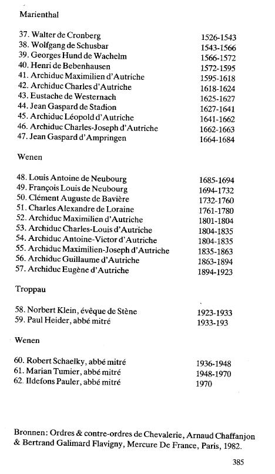

{style="width:2.625in;height:4.72222in"}

{style="width:2.77778in;height:4.77778in"}

( Wenen = Vienne )

\_\_\_\_\_\_\_\_\_\_\_\_\_\_\_\_\_\_\_\_\_\_\_\_\_\_\_\_\_\_\_\_\_\_\_\_\_\_\_\_\_\_\_\_\_\_\_\_\_\_\_\_\_\_\_\_\_\_\_\_\_\_\_\_\_\_\_\_\_\_\_\_\_

NOTES

CHAPITRE 1

1.  Wittemans Fr : \" Histoire des Rose-Croix \", p. 14, Éditions Boucher, La Haye, 1924 (copié de : La chaîne\' 1915-1916, nos 3 et 4, magazine A.M.O.R.R.C.).

2.  Paul S6dir : Histoire des Rose-Croix, Paris 1910

3.  Voir par exemple : Christopher Me Intosch : The Rosy Cross Unveiled, The History, Mythology and Rituals of an Occult Order, The Aquarian Press Ltd, Wellingbotough, Northamptonshire, 1980.

4.  Même sur l\'identité des auteurs des manifestes de la fraternité, tels que le Rama Fraternitas, règne la plus grande confusion. Le luthérien Johannes Valentinus Andreae est généralement incliné.

5.  Voir en : Histoire des Rose-Croix du Frère Wittemans : l\'histoire de Wassenaar

6.  De : L\'etrange Histoire des Rose-Croix, édition A.M.O.R.R.C., France, édition 1979.

7.  Dans : Wittemans Fr:\'Histoire des Rose-Croix\', p. 166-167, provenant de La Manche, volume 1916-1917.

8.  A.M.O.R.R.C.. : Ancien Ordre Mystique Rosae Crucis.

9.  Extrait du discours prononcé par l\'ancien grand maître de la juridiction néerlandophone : E.D.C. van Drenthem Soesman dans l\'auditorium du RUG le

```{=html}
<!-- -->
```
10. Edition : Rose-croix, j\'accuse.

11. Brochure A.M.O.R.R.C. : discours à l\'auditorium RUG le 14.10.76

12. De : Meesterschap over het leven (Maîtrise de la vie), document confidentiel publié par A.M.O.R.C. 1974, troisième édition.

13. Confirmé par trois témoignages, indépendants les uns des autres

14. Discours dans Aula-RUG, 14.10.76, publié dans la brochure A.M.O.R.R.C..

15. Vérifiez dans la bible.

16. De Drenthem-Soesman en A.M.O.R.C. brochure Aula-Rug 14.10.76

17. Le siège de la juridiction néerlandophone est situé à Gravenhage, aux Pays-Bas. Pour la juridiction francophone : Château d\'Omonville, le Tremblay, Le Neubourg, France.

18. Tu vois : Les Nouveaux Prophètes, Didier De Plaige et Jean-Marie Leduc, éd. Buchet-Castel, 1978, Paris Les Rose-Croix, Pierre Montloin & Jean- Pierre Bayard, Culture, Arts, Loisirs, 1971, Paris.

