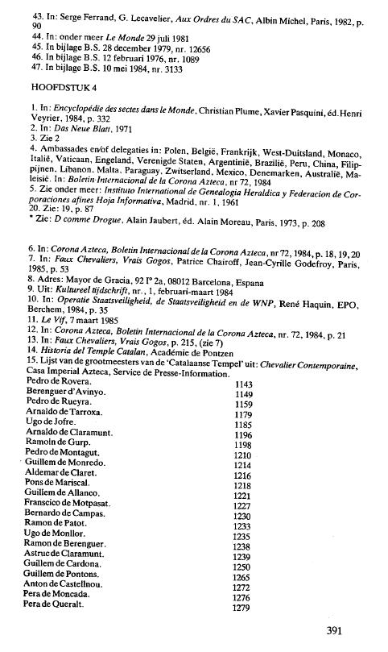
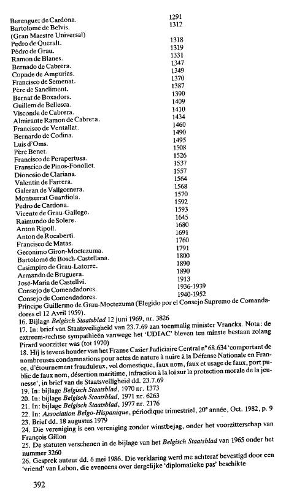

{style="width:2.86111in;height:4.79167in"}

(non traduit)

{style="width:2.76389in;height:4.81944in"}

(non traduit)

27. Dans : Association Belgo-Hispanique, périodique trimestriel oct. 1982, p4

28. Statuts publiés au Moniteur belge de 1973 sous le numéro 3717.

29. A la page 37

30. Dans : Association Belgo-Hispanique, octobre 1982, p. 9

31. Diario de Barcelona, 13 mars 1975

32. Selon le Temps de l\'Ordre, revue de l\'Ordre de la Rose et de la Croix de Jérusalem

33. Fondation à but non lucratif : annexe au Moniteur belge du 20 février 1968, n° 971.

34. Dans, entre autres choses : La Poste, le 15 février 1981

35. Message de Noël de Harry van Uden d\'Ophthoven à ses chevaliers en 1981

36. Dans : Chevaliers du Temple, dee ! 1

37. Vers avril 1986, la section belge de l\'Ordre de la Rose et de la Croix 1 se sépare de Harry van Uden van Ophoven. Je n\'en connais pas la raison. Désormais, les Templiers belges se nomment eux-mêmes\'Ordre du Temple en Flandre\'. A la tête de ce groupe se trouvaient deux vétérans de Harry : l\'ancien chancelier Ludo Huybrechts (décédé en 1987), directeur d\'entreprises et figure de la haute société anversoise, et l\'ancien commandant de pays Matthieu Driessen, architecte et président du comité des pèlerinages du Limbourg en fer.

CHAPITRE 5

1.  Les deux personnes ont fondé en 1981 la société espagnole S.A. Combigargo, qui exploite une flotte marchande à destination et en provenance du continent africain.

2.  Juridictions nationales 4 in : Arménie, Australie, Autriche, Belgique, Bulgarie, Canada, Danemark, Groenland, Angleterre, Finlande, France, Géorgie, Allemagne de l\'Ouest, Hongrie, Irlande, Italie, Malte, Pays-Bas, Nouvelle-Zélande, Portugal, Rhodésie, Roumanie, Russie, Ecosse, Afrique du Sud, Espagne, Suède, Suisse, Etats-Unis, en : Décrets constitutionnels, 1979, p. 17

3.  Dans : Décrets constitutionnels, 15 mai 1979, Décret n° 55

4.  Les membres de la \" Junta 4 \" sont : (au 30 juin 1985) Alberto Daveno ; Antonio Spada ; Mario-Enrico Viona, comte de Bastide ; Don Giovanni et Pietro, duc de Caffarelli ; Michel de Gorski.

5.  Décret du 30 juillet 1791

6 . Osservatore Romano 15-16 avril 1935

7.  L\'histoire de l\'Ordre est racontée à travers les ouvrages suivants :

```{=html}
<!-- -->
```
8.  Dans : Memento du Chevalier de Saint-Lazare de Jérusalem, Paris, 1974.

9.  Le 19 août 1982, les statuts de la section belge figuraient en annexe au Moniteur belge (n° 8970). Parmi les fondateurs : Paul Pourbaix, le Prince Marescotti Ruspoli di Poggio Suasa, le Baron Philippe Giltes de Pelichy, le Comte Rodolphe de Brouchoven de Bergeyck.

10. Tu vois : L\'Opus Dei en Belgique, André Van Bosbeke, OEB, Berchem- Anvers, 1985, p. 70,71,89,93,106

11. Dans : L\'Empire Moon, Jean-Frangois Boyer, Ed. La D 6 couverte, Paris, 1986, p. 69,70 et suivantes.

```{=html}
<!-- -->
```
12. Dans : VEmpire Moon, p. 81 et interview dans le magazine de la secte de la Lune

13. Octobre 1982, p. 29, 30

14. Réimprimé dans Vrij Nederland, 11 septembre 1982.

15. Dans : Deutsche Tagespost, 8 novembre 1983

16. Également appelé \" Cercle Pinay 4 \", du nom de l\'actuel fondateur de la société, l\'ancien homme fort de France, Antoine Pinay. Le 6 mars 1952, il est nommé Président du Conseil 4 et Ministre des Finances 4 de France. Pinay a également eu une belle main dans le changement de pouvoir en faveur du général de Gaulle.

