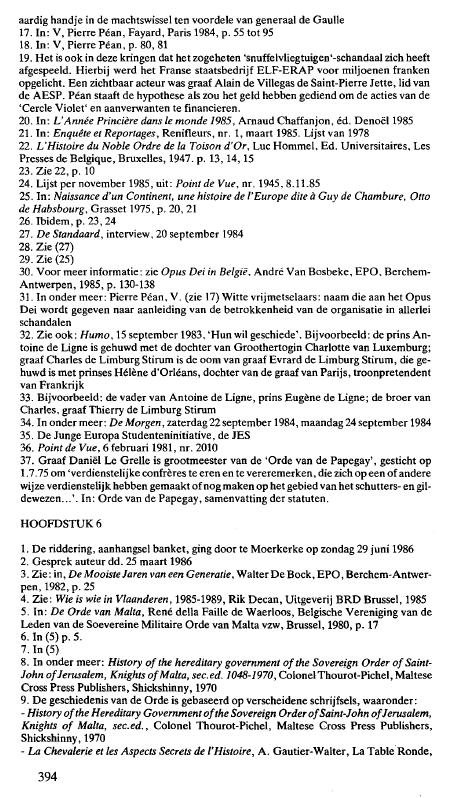

{style="width:2.69444in;height:4.73611in"}

Not in french :

19\. C\'est également dans ces cercles qu\'a eu lieu le scandale dit des \"avions renifleurs\". L\'entreprise publique française ELF-ERAP a été escroquée pour des millions de francs. Le comte Alain de Villegas de Saint- Pierre Jette, membre de l\'AESP, était un acteur visible. Pean soutient l\'hypothèse que l\'argent aurait été utilisé pour financer les actions du \"Cercle Violet 1 et des parties liées.

30. Pour plus d\'informations : voir l\'Opus Dei en Belgique, André Van Bosbeke, OEB, Berchem-Anvers, 1985, p. 130-138.

31. En particulier : Pierre Pean, V. (voir 17) Francs-maçons blancs : nom donné à l\'Opus Dei en raison de l\'implication de l\'organisation dans toutes sortes de scandales.

32. Voir aussi : Humo, 15 septembre 1983,\'Leur volonté soit faite\'. Par exemple : le prince Antoine de Ligne est marié à la fille de la Grande- Duchesse Charlotte de Luxembourg ; le comte Charles de Limburg Stirum est l\'oncle du comte Evrard de Limburg Stirum, qui est marié à la princesse Hdlene d\'Orléans, fille du comte de Paris, prétendant au trône de France.

33. Par exemple : le père d\'Antoine de Ligne, le prince Eugène de Ligne ; le frère de Charles, le comte Thierry de Limburg Stirum.

34. En particulier : De Morgen, samedi 22 septembre 1984, lundi 24 septembre 1984

35. L\'initiative des étudiants Junge Europa, le JES

36. Point de Vue, 6 février 1981, n° 2010.

37. Le Comte Daniel Le Grelle est grand maître de l\'Ordre du Papegay, fondé le 1.7.75 pour \" honorer et mériter des confrères méritants, qui d\'une manière ou d\'une autre ont fait ou se font méritants dans le domaine du tir à l\'arc et du système de guilde\... \". Dans : Ordre du Papegay, résumé des statuts.

CHAPITRE 6

1.  La chevalerie, banquet en annexe, s\'est poursuivie à Moerkerke le dimanche 29 juin 1986.

2.  Auteur de la conversation le 25 mars 1986

3.  Voir : dans Les plus belles années d\'une génération, Walter De Bock, OEB, Berchem-Anvers, 1982, p. 25.

4.  Tu vois : Qui est qui en Flandre, 1985-1989, Rik Decan, Maison d\'édition BRD Bruxelles, 1985

5.  Dans : L\'Ordre de Malte, René de la Faille de Waerloos, Association belge des membres de l\'asbl Ordre souverain militaire de Malte, Bruxelles, 1980, p. 17.

```{=html}
<!-- -->
```
8.  En particulier : Histoire du gouvernement héréditaire de l\'Ordre Souverain de Saint-Jean de Jérusalem, Chevaliers de Malte, sec.ed. 1048- 1970, Colonel Thourot-Pichel, Maltese Cross Press Publishers, Shickshinny, 1970.

9.  L\'histoire de l\'Ordre est basée sur plusieurs écrits, notamment :

